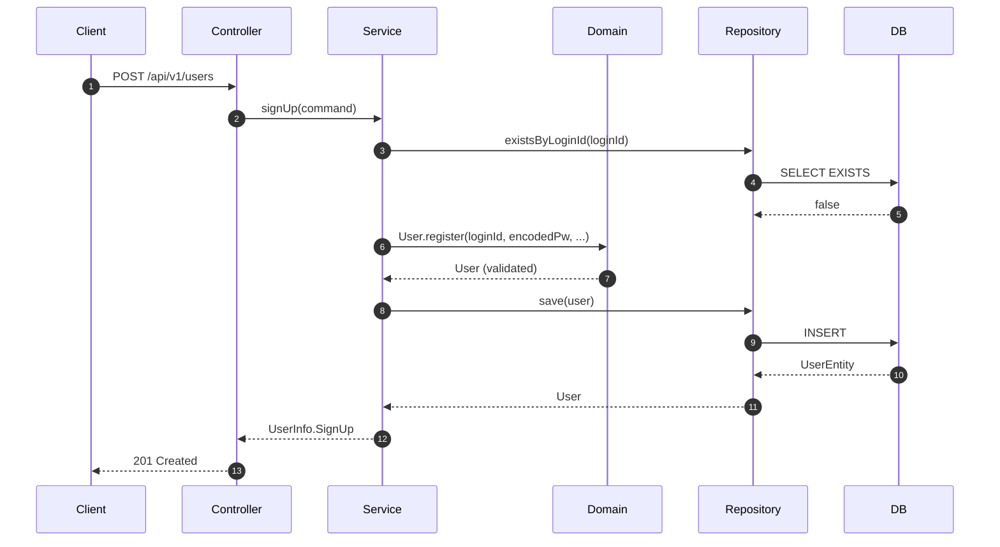
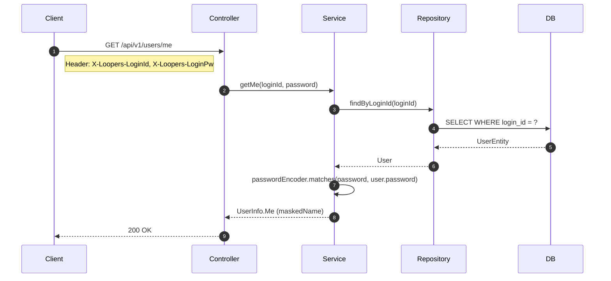
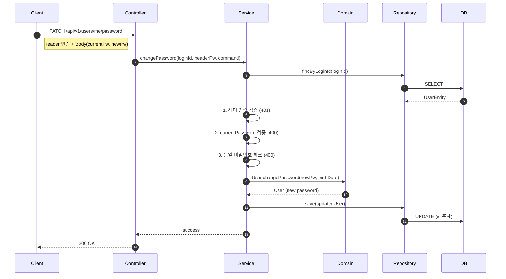

## 📌 Summary

- 배경: 1주차 과제로 User 도메인의 핵심 API 3개(회원가입, 내 정보 조회, 비밀번호 변경)를 구현해야 한다.
- 목표: Outside-In TDD(Controller → Service → Domain → Repository)로 구현하고, 각 레이어별 테스트 커버리지를 확보한다.
- 결과: 3개 API 엔드포인트 구현 완료, E2E/Unit/Integration 테스트 전체 통과

## 💬 리뷰 포인트

- 주로 Java를 사용해왔고 코프링은 이번이 처음인데, BaseEntity의 id를 `val`에서 `var`로 바꿔야 하는 등 예상 못한 부분이 있었습니다. 코프링으로 JPA Entity를 운영하시면서 초기에 설계해두지 않으면 나중에 바꾸기 어려운 것들이 있다면 어떤 것들이 있는지 궁금합니다.

  ```kotlin
  // modules/jpa - BaseEntity.kt
  @Id @GeneratedValue(strategy = GenerationType.IDENTITY)
  var id: Long? = null
      protected set

  // apps/commerce-api - UserEntity.kt
  class UserEntity(id: Long?, ...) : BaseEntity() {
      init { this.id = id }  // id가 null이면 INSERT, non-null이면 UPDATE
  }
  ```

- 현재 매 요청마다 헤더로 비밀번호를 평문 전송하는 방식입니다. 비밀번호가 매번 네트워크를 타기 때문에 탈취 위험이 있고, 로그인 한 번으로 끝나는 세션이나 JWT 방식에 비해 노출 빈도가 높다는 점이 한계라고 생각합니다. 실무에서는 세션, JWT, BFF+쿠키 등 다양한 인증 방식이 쓰이고 있는데, 인증 방식을 선택하실 때 어떤 기준으로 선택하시는지
  그리고 서비스 중에 인증 구조를 변경한 경험이 있으시다면 그 계기와 어떤 선택을 하셨는지 궁금합니다.

  ```kotlin
  // apps/commerce-api - UserService.kt :: getMe()
  val user = userRepository.findByLoginId(loginId)
      ?: throw CoreException(ErrorType.UNAUTHORIZED)
  if (!passwordEncoder.matches(password, user.password))  // 매 요청마다 BCrypt 수행
      throw CoreException(ErrorType.UNAUTHORIZED)
  ```

- 비밀번호 변경에서 헤더 인증 실패(401)와 body의 currentPassword 불일치(400)를 구분했습니다. 같은 비밀번호 검증이지만 인증과 비즈니스 검증의 책임이 다르다고 판단했는데, 이 구분이 적절한지 의견을 듣고 싶습니다.

  ```kotlin
  // apps/commerce-api - UserService.kt :: changePassword()
  if (!passwordEncoder.matches(headerPassword, user.password))
      throw CoreException(ErrorType.UNAUTHORIZED)           // 헤더 인증 실패 → 401
  if (!passwordEncoder.matches(command.currentPassword, user.password))
      throw CoreException(ErrorType.USER_INVALID_PASSWORD)  // body 검증 실패 → 400
  ```

## 🧭 Context & Decision

### 문제 정의

- 현재 동작/제약: 기존에 Example 도메인만 존재하며, User 도메인과 인증 체계가 없다.
- 문제(또는 리스크): 인증 없이는 사용자별 데이터 관리가 불가능하다.
- 성공 기준(완료 정의): 3개 API가 정상 동작하고, 각 레이어별 테스트가 통과한다.

### 선택지와 결정

- 고려한 대안:
    - A: Spring Security 필터 기반 인증
    - B: `@RequestHeader`로 직접 헤더 추출하는 간이 인증
- 최종 결정: B안 - 헤더 직접 추출 방식
- 트레이드오프: 보안성은 낮지만, 1주차 학습 범위에 적합하고 인증 흐름을 직접 이해할 수 있다. TLS는 인프라 영역으로 가정한다.
- 추후 개선 여지: Spring Security + JWT 기반 인증으로 전환 가능

## 🏗️ Design Overview

### 변경 범위

- 영향 받는 모듈/도메인: `apps/commerce-api` (user 도메인), `modules/jpa` (BaseEntity)
- 신규 추가: User 도메인 전체 (interfaces, application, domain, infrastructure)
- 제거/대체: 없음

### 주요 컴포넌트 책임

- `UserV1Controller`: HTTP 요청/응답 처리, 헤더 인증 정보 추출, Dto <-> Command 변환
- `UserService`: 비즈니스 로직 (중복 체크, BCrypt 암호화/검증, 인증 처리)
- `User`: 도메인 모델 (입력값 검증 - loginId/password/name 패턴, 생년월일 포함 검증, 이름 마스킹)
- `UserRepository/Impl`: 영속성 추상화/구현 (save, existsByLoginId, findByLoginId)
- `BaseEntity`: id를 `var`로 변경하여 Entity 생성 시 id 할당 가능 (UPDATE 지원)

## 🔁 Flow Diagram

### Main Flow - 회원가입



### Main Flow - 내 정보 조회



### Main Flow - 비밀번호 변경


