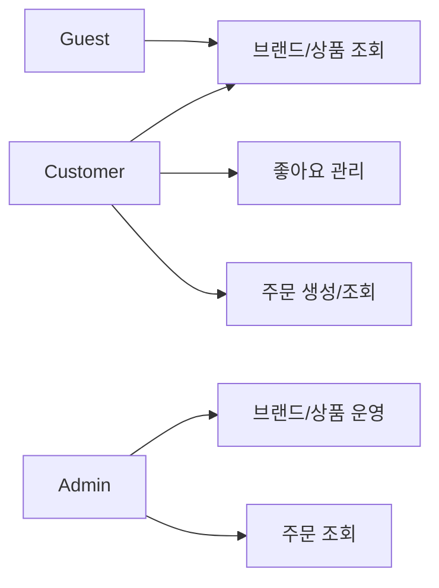
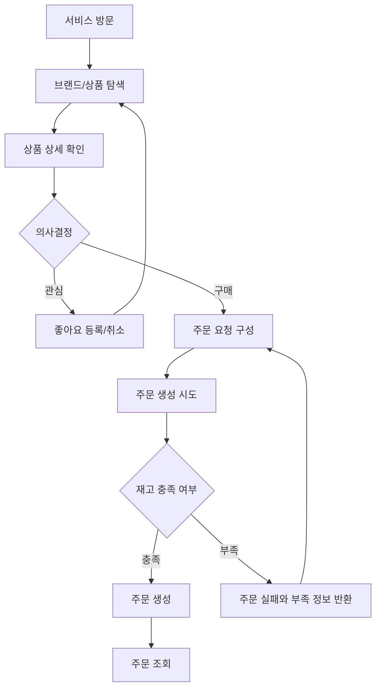

# 요구사항 정의서

- **작성자**: 김민주
- **최종 수정일**: 2026-02-14

## 1. 소개

### 1.1 문서의 목적

- 이 문서는 학습 목적의 이커머스 시스템에 대한 사용자 흐름과 비즈니스 정책을 정의한다.
- 후속 설계 산출물(시퀀스 다이어그램, 클래스 다이어그램, ERD)의 기준을 제공한다.

### 1.2 서비스 개요

- Customer가 브랜드/상품을 탐색하고, 좋아요를 등록하고, 주문을 생성/조회한다.
- Admin은 브랜드/상품을 관리하고 주문 현황을 조회한다.

### 1.3 기능 범위 (In Scope)

- Customer: 브랜드/상품 탐색, 좋아요 등록/취소/목록 조회, 주문 생성, 주문 조회
- Admin: 브랜드/상품 정보 관리(등록/변경/삭제) 및 노출 상태 관리, 전체 주문 현황 조회
- 사용자 전체 여정 표현: 비회원/회원/어드민의 접근 가능 기능

### 1.4 가정 및 제약

- 단일 판매 단위(옵션 없음)를 가정한다.

### 1.5 범위 제외 (Out of Scope)

다음은 이번 문서의 기능 범위에서 제외한다:

- 결제: 추후 확장 포인트로만 다룬다
- 장바구니: "여러 상품 동시 주문"은 주문 생성 시 상품 목록을 직접 전달하는 방식으로 지원한다
- 인증/인가의 완전한 구현: 역할 식별과 접근 제약 원칙만 정의한다

기능 범위의 변경은 명시적 합의와 문서 개정을 통해서만 반영한다.

### 1.6 용어 정의

상세한 도메인 용어 정의는 [유비쿼터스 언어 (Ubiquitous Language)](./00-ubiquitous-language.md) 문서를 참조한다.

## 2. 사용자/역할 정의

- Guest: 로그인 없이 공개 조회 기능을 사용하는 주체
- Customer: 상품을 탐색하고 좋아요/주문을 생성 및 조회하는 주체
- Admin: 브랜드/상품의 노출 상태를 관리하고 주문을 조회하는 주체

## 3. 전체 서비스 흐름

### 3.1 역할별 접근 흐름

### 3.2 Customer 전체 여정

## 4. 사용자 시나리오 기반 기능 요구사항

### 4.1 브랜드/상품 탐색

- 목표: Customer가 구매할 상품을 탐색하고 상세 정보를 확인한다.
- 기본 흐름:
    1. Customer는 브랜드/상품 목록을 조회한다.
    2. Customer는 조건(브랜드, 정렬, 페이지)에 따라 상품 목록을 조회한다.
    3. Customer는 상품 상세 정보를 조회한다.
- 예외 흐름:
    - 노출되지 않는 브랜드/상품은 조회되지 않는다.
    - 존재하지 않는 식별자 요청은 실패한다.

### 4.2 좋아요 관리

- 목표: Customer가 관심 상품을 표시하고 관리한다.
- 사전 조건: Customer 식별이 가능해야 한다.
- 기본 흐름:
    1. Customer는 상품 좋아요를 등록한다.
    2. Customer는 상품 좋아요를 취소한다.
    3. Customer는 본인의 좋아요 목록을 조회한다.
- 예외 흐름:
    - 존재하지 않는 상품 요청은 실패한다.
    - 타 Customer의 좋아요 데이터 접근은 차단한다.

### 4.3 주문 생성 및 조회

- 목표: Customer가 여러 상품을 한 주문으로 생성하고 조회한다.
- 사전 조건: 주문할 상품 목록(상품 식별자, 수량)이 결정되어 있다.
- 기본 흐름:
    1. Customer는 주문할 상품 목록과 수량을 전달한다.
    2. 시스템은 상품 존재 여부와 재고를 검증한다.
    3. 시스템은 주문을 생성하고 재고를 차감한다.
    4. Customer는 본인 주문 목록 및 주문 상세를 조회한다.
- 예외 흐름:
    - 재고가 부족한 상품이 있으면 주문 전체가 실패한다.
    - 존재하지 않는 상품이 포함되면 주문이 실패한다.
    - 타 Customer의 주문 데이터 접근은 차단한다.

### 4.4 Admin 브랜드/상품 관리 및 주문 조회

- 목표: Admin이 카탈로그를 운영하고 주문 현황을 모니터링한다.
- 기본 흐름:
    1. Admin은 브랜드/상품 정보를 등록/변경/삭제한다.
    2. Admin은 브랜드/상품의 노출 상태를 관리한다.
    3. Admin은 전체 주문 목록 및 주문 상세를 조회한다.
- 예외 흐름:
    - 존재하지 않는 브랜드/상품/주문 식별자 요청은 실패한다.

## 5. 비즈니스 규칙 및 정책

### 5.1 노출 원칙

- Customer에게 노출되지 않는 브랜드/상품은 목록/상세에서 확인할 수 없다.
- 브랜드가 노출되지 않으면 해당 브랜드의 상품도 Customer에게 노출되지 않는다.
- 삭제된 브랜드/상품은 기본 조회에서 노출되지 않는다.

### 5.2 주문 생성 정합성 (All-or-Nothing)

- 주문 수량은 해당 상품의 재고 수량을 초과할 수 없다.
- 재고 차감은 주문 생성 시점에 수행한다.
- 주문 내 일부 상품의 재고가 부족하면 주문 전체가 실패한다(부분 주문 불가).
- 재고 부족 시 응답에는 부족한 상품과 주문 가능 수량을 포함한다.
- 요청 항목에 동일 상품이 중복되면 수량 합산 후 검증한다.
- 동일 주문 생성 요청의 재시도에서 중복 주문이 생성되지 않아야 한다.

### 5.3 주문 스냅샷 보존

- 주문 생성 시점의 상품/브랜드/가격/수량 정보를 주문 항목에 보존한다.
- 이후 상품 정보가 변경되어도 주문 스냅샷은 변경되지 않는다.

### 5.4 접근 원칙

- Customer는 본인 데이터(좋아요/주문)만 조회/관리할 수 있다.
- Admin 기능은 운영 권한을 가진 주체만 접근할 수 있다.

### 5.5 브랜드-상품 종속 원칙

- 상품은 반드시 하나의 브랜드에 소속된다. 브랜드 없는 상품은 존재할 수 없다.
- 상품의 브랜드는 변경되지 않는다.
- 브랜드가 삭제되면 해당 브랜드의 모든 상품도 함께 삭제된다.

## 6. 비기능 요구사항

### 6.1 서비스 규모 가정

> 아래 수치는 기술적 의사결정의 기준점을 제공하기 위한 가정이다.
> 이후 학습 과정에서 트래픽 증가 시나리오를 별도로 가정할 수 있다.

- 등록 사용자: 약 10,000명
- DAU: 약 1,000명
- 동시 접속(피크): 약 200명
- 상품: 약 5,000 SKU
- 주문: 일 약 300건

### 6.2 성능

- 상품 목록 조회 응답 시간은 200ms 이내여야 한다 (p95 기준).
- 주문 생성 응답 시간은 500ms 이내여야 한다 (p95 기준).
- 피크 시 200명 동시 접속에서 성능 저하 없이 서비스해야 한다.

### 6.3 데이터 정합성

- 동일 상품에 대한 동시 주문 시 재고가 음수가 되어서는 안 된다.
- 네트워크 재시도 등 동일 요청이 중복 도달하더라도 주문이 한 번만 생성되어야 한다.

### 6.4 가용성

- 개별 기능의 장애가 전체 서비스를 중단시키지 않아야 한다.

## 7. 확장 포인트

- 결제 처리 및 결제 상태 관리
- 미결제 자동 취소 및 재고 복구
- 쿠폰
