# 클래스 다이어그램 (도메인 모델)

- **작성자**: 김민주
- **최종 수정일**: 2026-02-14

## 목차

- [1. 개요](#1-개요)
    - [1.1 문서 목적](#11-문서-목적)
    - [1.2 핵심 설계 원칙: 핵심 비즈니스 규칙과 구현 세부사항의 분리](#12-핵심-설계-원칙-핵심-비즈니스-규칙과-구현-세부사항의-분리)
    - [1.3 다이어그램 구성 전략](#13-다이어그램-구성-전략)
- [2. 전체 도메인 모델 개요](#2-전체-도메인-모델-개요)
    - [2.1 Aggregate Root 및 Value Object 관계도](#21-aggregate-root-및-value-object-관계도)
    - [2.2 Enumeration 타입 정의](#22-enumeration-타입-정의)
- [3. Aggregate별 상세 설계](#3-aggregate별-상세-설계)
    - [3.1 User Aggregate](#31-user-aggregate)
    - [3.2 Brand Aggregate](#32-brand-aggregate)
    - [3.3 Product Aggregate](#33-product-aggregate)
    - [3.4 ProductStock Aggregate](#34-productstock-aggregate)
    - [3.5 ProductLike Aggregate](#35-productlike-aggregate)
    - [3.6 Order Aggregate](#36-order-aggregate)
- [4. Value Objects: 도메인 개념의 캡슐화](#4-value-objects-도메인-개념의-캡슐화)
    - [4.1 래퍼 VO (Wrapper Value Objects)](#41-래퍼-vo-wrapper-value-objects)
    - [4.2 구조 VO (Structural Value Objects)](#42-구조-vo-structural-value-objects)
- [5. DomainService: 주문 생성 조율](#5-domainservice-주문-생성-조율)
    - [5.1 OrderDomainService](#51-orderdomainservice)
- [6. 설계 결정 사항](#6-설계-결정-사항)
    - [결정 1: ProductStock을 Product에서 분리하여 별도 Aggregate](#결정-1-productstock을-product에서-분리하여-별도-aggregate)
    - [결정 2: Order에서 재고 검증 로직 제외](#결정-2-order에서-재고-검증-로직-제외)
    - [결정 3: OrderDomainService로 조율](#결정-3-orderdomainservice로-조율)
    - [결정 4: OrderSnapshot을 OrderItem 내부 VO로 분리](#결정-4-ordersnapshot을-orderitem-내부-vo로-분리)
    - [결정 5: Brand와 Product를 별도 Aggregate](#결정-5-brand와-product를-별도-aggregate)
    - [결정 6: ProductLike를 독립 Aggregate](#결정-6-productlike를-독립-aggregate)
    - [결정 7: Price를 Product 속성으로 유지](#결정-7-price를-product-속성으로-유지)
    - [결정 8: 트랜잭션 전략 - 실용적 단일 트랜잭션](#결정-8-트랜잭션-전략---실용적-단일-트랜잭션)
- [7. 요구사항 추적](#7-요구사항-추적)
    - [비즈니스 규칙 → 도메인 요소 매핑](#비즈니스-규칙--도메인-요소-매핑)

## 1. 개요

### 1.1 문서 목적

본 문서는 요구사항 정의서(`01-requirements.md`)와 유비쿼터스 언어(`00-ubiquitous-language.md`)를 도메인 모델로 전환한 설계 문서다. DDD(Domain-Driven Design)의 구성요소를 활용하여, 비즈니스 규칙을 Aggregate, Entity, Value Object, Domain Service로 모델링한다.

### 1.2 핵심 설계 원칙: 핵심 비즈니스 규칙과 구현 세부사항의 분리

시간이 지나도 반드시 지켜야 하는 규칙(핵심 비즈니스 규칙)과, 필요에 따라 바꿀 수 있는 구현 방식(구현 세부사항)을 분리한다. 각 클래스는 다음을 명확히 구분한다:

- **핵심 비즈니스 규칙**: 비즈니스의 본질적인 규칙과 True Invariant
- **구현 세부사항**: 시간에 따라 변경 가능한 구현 전략과 검증 방식

True Invariant(불변식)란, 어떤 상황에서도 반드시 지켜져야 하는 규칙을 말한다. 예를 들어 "재고 수량은 0 미만이 될 수 없다"는 ProductStock의 True Invariant다.

예를 들어, Order의 본질은 **"계약서 작성"** — 구매 의사를 항목과 스냅샷으로 기록하는 것이다. 재고 검증 방식이나 결제 정책은 변경 가능한 구현 세부사항이므로, Order 객체가 아닌 OrderDomainService가 담당한다.

### 1.3 다이어그램 구성 전략

DDD 클래스 다이어그램 작성 시 한 다이어그램이 한눈에 이해 가능한 적정 수(5-9개, Rule of 7±2)를 넘지 않도록 구성한다. 본 문서는 다음과 같이 구성한다:

- **전체 개요 다이어그램** (섹션 2): 모든 Aggregate Root와 Value Object의 관계를 한눈에 파악
- **Aggregate별 상세 다이어그램** (섹션 3): 각 Aggregate 내부 구조를 상세히 표현

다이어그램은 설계 의도를 설명하는 글의 보조 도구다. 시각적 표현만으로 설계를 완전히 이해할 수 없으며, 각 Aggregate별 설명 섹션과 설계 결정 사항을 함께 읽어야 한다.

## 2. 전체 도메인 모델 개요

### 2.1 Aggregate Root 및 Value Object 관계도

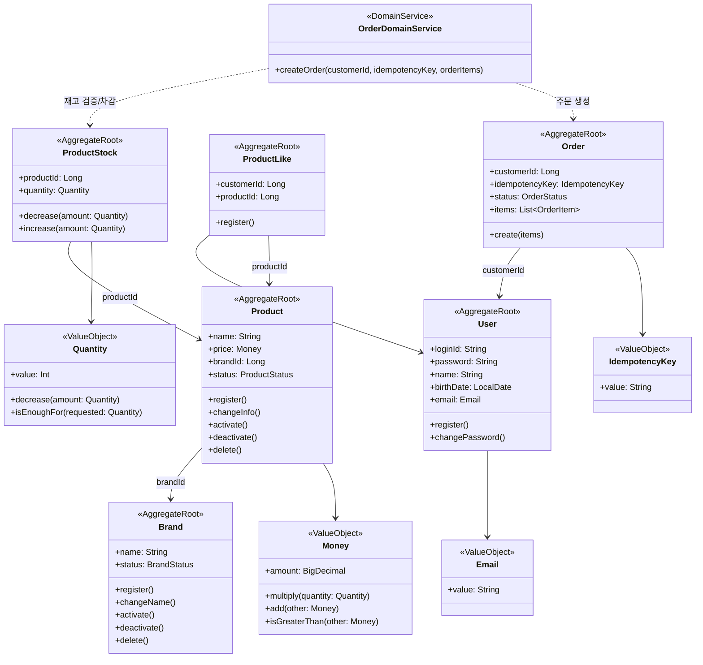

### 2.2 Enumeration 타입 정의

#### BrandStatus

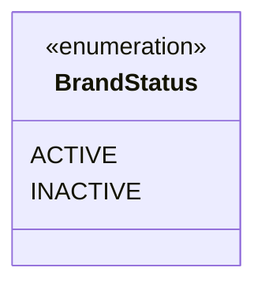

- **ACTIVE**: 브랜드가 활성 상태이며 Customer에게 노출된다
- **INACTIVE**: 브랜드가 비활성 상태이며 Customer 조회에서 제외된다

#### ProductStatus

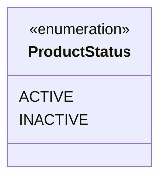

- **ACTIVE**: 상품이 활성 상태이며 Customer에게 노출된다
- **INACTIVE**: 상품이 비활성 상태이며 Customer 조회에서 제외된다

#### OrderStatus

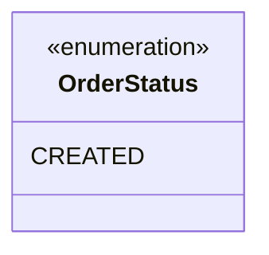

- **CREATED**: 주문이 생성되어 시스템에 기록된 상태다
- 현재 범위에서는 결제를 다루지 않으므로, 주문 흐름의 최종 상태다
- 결제 도입 시 `PAID`, `CANCELLED` 등으로 확장 가능하다 (요구사항 7)

## 3. Aggregate별 상세 설계

### 3.1 User Aggregate

#### 책임 범위

User Aggregate는 시스템 사용자의 신원을 관리한다. Customer와 Admin 역할을 구분하지 않고 단일 User로 모델링하며, 역할은 접근 제어 레벨에서 처리한다.

#### 클래스 다이어그램

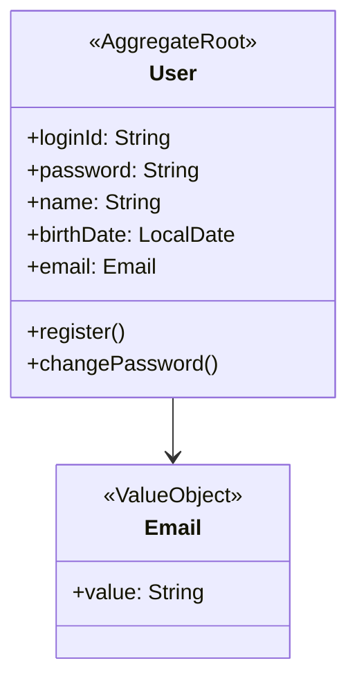

#### 본질적 책임

- **사용자 신원 관리**: loginId, password, email을 통한 식별 및 인증

#### True Invariant

- `loginId` 유일성 (시스템 내에서 중복될 수 없다)
- `email` 형식 검증 (Email VO를 통해 보장된다)

#### 핵심 비즈니스 규칙 vs 구현 세부사항

| 핵심 비즈니스 규칙                           | 구현 세부사항                      |
|--------------------------------------|------------------------------|
| 사용자 신원 관리 (loginId, password, email) | 인증 방식 (비밀번호 vs OAuth vs JWT) |
| loginId 유일성                          | 역할 관리 방식 (단일 역할 vs 다중 역할)    |

---

### 3.2 Brand Aggregate

#### 책임 범위

Brand Aggregate는 상품의 정체성을 부여하는 주체다. 브랜드 없는 상품은 존재할 수 없으며(요구사항 5.5), Customer는 브랜드를 기준으로 상품을 탐색하고 선호도를 형성한다.

#### 클래스 다이어그램

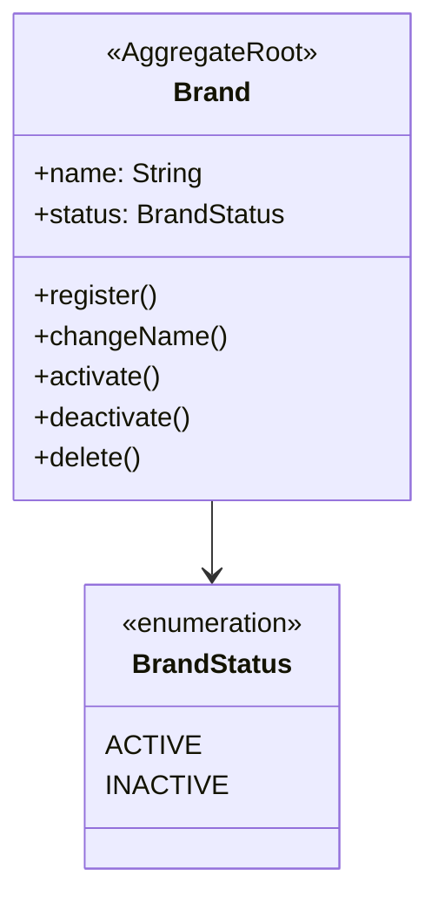

#### 본질적 책임

- **상품의 정체성 부여**: 브랜드명을 통해 상품 그룹의 정체성을 표현한다
- **노출 제어**: Admin이 관리하는 활성/비활성 상태를 통해 Customer 노출 여부를 결정한다

#### True Invariant

- `name` 필수 (브랜드명 없이는 정체성 부여가 불가능하다)
- 삭제된 브랜드의 상품은 함께 삭제된다 (요구사항 5.5 - Cascade Delete)

#### 관계

- **Product → Brand (ID 참조)**: Product.brandId로 소속 브랜드를 참조한다. Aggregate 간 직접 객체 참조를 피하고 ID 참조를 사용한다 (Vernon Rule 3)

#### 핵심 비즈니스 규칙 vs 구현 세부사항

| 핵심 비즈니스 규칙        | 구현 세부사항                            |
|-------------------|------------------------------------|
| 브랜드명으로 상품 정체성 부여  | 노출 정책 (활성/비활성 기준 변경 가능)            |
| 브랜드 삭제 시 상품 함께 삭제 | 브랜드 계층 구조 (향후 확장 시 부모/자식 관계 도입 가능) |

---

### 3.3 Product Aggregate

#### 책임 범위

Product Aggregate는 판매 단위의 카탈로그 정보를 관리한다. Customer가 구매할 수 있는 최소 단위이며, 브랜드에 소속되어 가격과 이름으로 식별된다.

#### 클래스 다이어그램

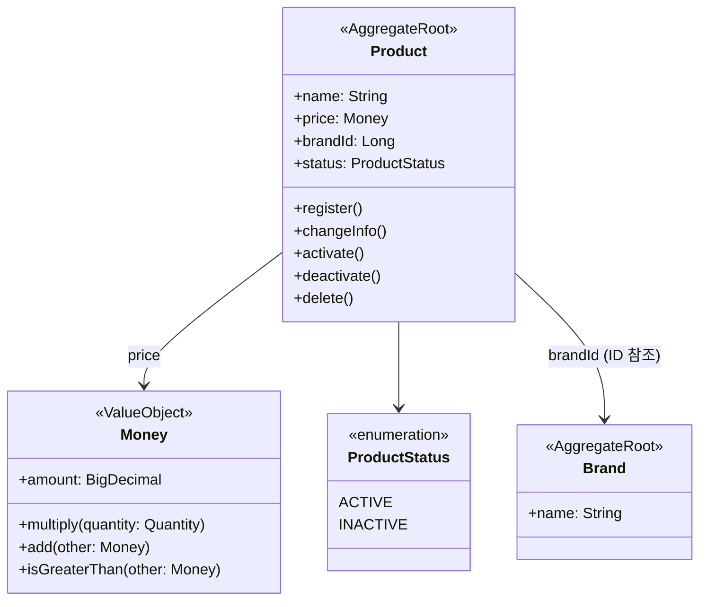

#### 본질적 책임

- **판매 단위의 정보 관리**: 상품명, 가격, 소속 브랜드 정보를 보유한다
- **노출 제어**: 활성/비활성 상태를 통해 Customer 조회 가능 여부를 결정한다

#### True Invariant

- `name`, `price` 필수
- `brandId` 불변 (요구사항 5.5 - 상품의 브랜드는 변경되지 않는다)
- 브랜드가 노출되지 않으면 상품도 노출되지 않는다 (요구사항 5.1)

#### ProductStock 분리 근거

Product와 ProductStock은 **서로 다른 불변식(True Invariant)**을 가진다:

- **Product**: 카탈로그 정보 (name, price, brandId)의 정합성
- **ProductStock**: 재고 수량 (quantity >= 0)의 정합성

상품명 변경과 재고 증감은 서로 영향을 주지 않으므로, Aggregate는 가능한 작게 설계한다는 원칙에 따라 별도 Aggregate로 분리했다. 이는 트랜잭션 경합을 줄이고 각 Aggregate의 책임을 명확히 한다.

#### 관계

- **Product → Brand (ID 참조)**: 소속 브랜드를 brandId로 참조한다 (Aggregate 간에는 ID 값으로만 참조한다는 원칙)
- **ProductStock → Product (ID 참조)**: ProductStock.productId로 1:1 대응한다

#### 핵심 비즈니스 규칙 vs 구현 세부사항

| 핵심 비즈니스 규칙        | 구현 세부사항                          |
|-------------------|----------------------------------|
| 판매 단위의 카탈로그 정보 관리 | 노출 정책, 가격 전략                     |
| 브랜드 소속 (불변)       | 옵션 확장 (현재 단일 판매 단위, 향후 옵션 추가 가능) |

---

### 3.4 ProductStock Aggregate

#### 책임 범위

ProductStock Aggregate는 재고 수량의 정합성을 보장한다. 동시 주문 상황에서 재고가 음수가 되지 않도록 하는 것이 핵심 책임이다 (요구사항 6.3).

#### 클래스 다이어그램

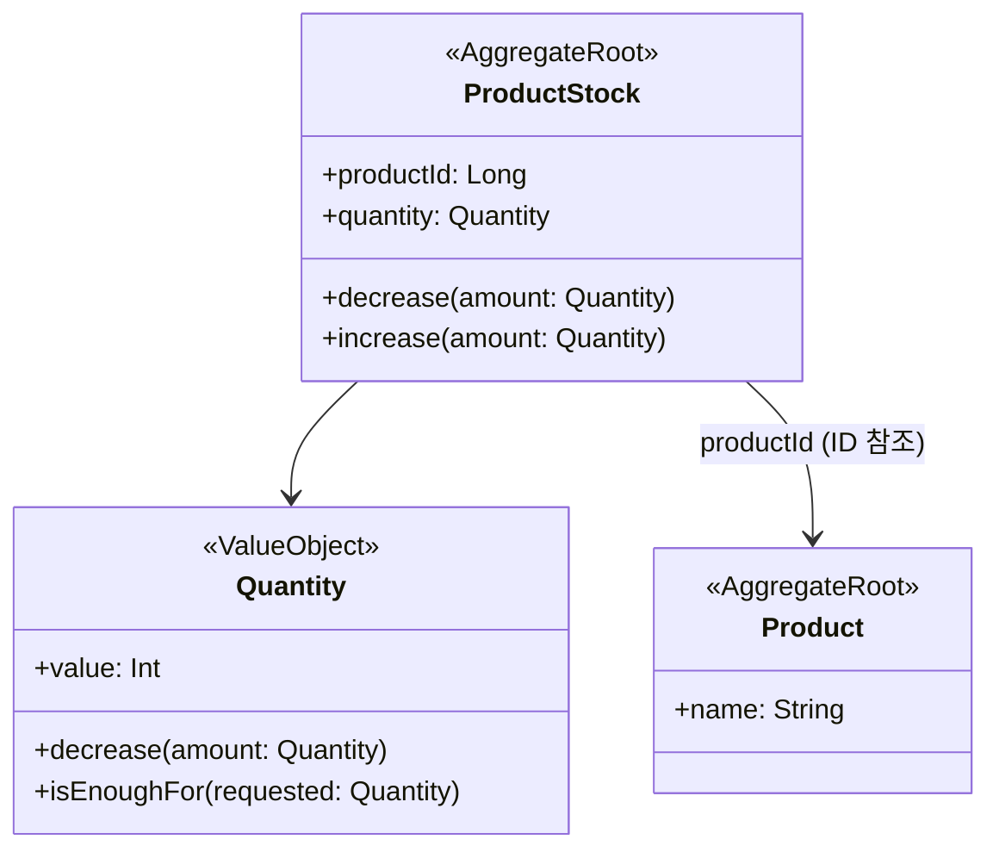

#### 본질적 책임

- **재고 수량의 정합성 보장**: quantity >= 0 불변식을 트랜잭션 내에서 보호한다
- **재고 증감 연산**: decrease(), increase() 메서드를 통해 안전한 재고 변경을 수행한다

#### True Invariant

- **quantity >= 0**: 재고는 절대 음수가 될 수 없다 (동시성 제어 필요)
- **decrease(amount) 시**: `quantity - amount >= 0` 검증 후 차감하며, 그렇지 않으면 예외를 발생시킨다

#### Product 분리 근거

ProductStock을 Product에서 분리한 이유:

1. **서로 다른 불변식**: Product는 카탈로그 정보, ProductStock은 재고 수량 정합성
2. **독립적 변경 주기**: 상품명 변경과 재고 증감은 서로 영향 없다
3. **트랜잭션 경합 감소**: 재고 차감 트랜잭션과 상품 정보 수정 트랜잭션이 분리된다
4. **Small Aggregate 원칙 준수**: Aggregate는 Root Entity + 최소 구성으로 작게 설계한다

#### 관계

- **ProductStock → Product (ID 참조)**: productId로 1:1 대응한다

#### 핵심 비즈니스 규칙 vs 구현 세부사항

| 핵심 비즈니스 규칙        | 구현 세부사항                  |
|-------------------|--------------------------|
| quantity >= 0 불변식 | 재고 확인 시점 (실시간 vs 예약 재고)  |
| 안전한 증감 연산         | 차감 방식 (즉시 차감 vs 예약 후 확정) |

---

### 3.5 ProductLike Aggregate

#### 책임 범위

ProductLike Aggregate는 Customer의 특정 상품에 대한 선호를 표시하고 저장한다. 요구사항 4.2에 따라 Customer는 좋아요를 등록/취소하고 목록을 조회할 수 있다.

#### 클래스 다이어그램

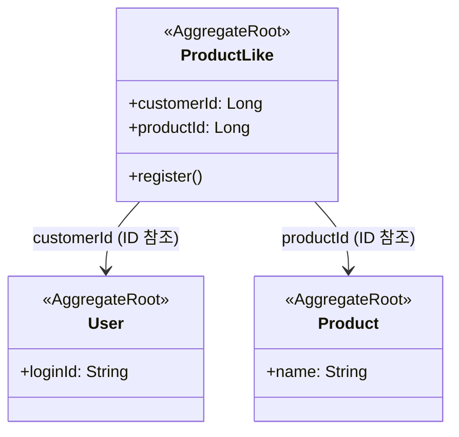

#### 본질적 책임

- **Customer의 선호 표시**: 누가(customerId) 어떤 상품(productId)을 좋아하는지 기록한다

#### True Invariant

- `(customerId, productId)` 쌍의 유일성 (중복 좋아요를 방지한다)
- 존재하지 않는 상품에 대한 좋아요 등록이 불가능하다 (요구사항 4.2)

#### 독립 Aggregate 근거

ProductLike를 Product 내부에 두지 않은 이유:

1. **서로 다른 컨텍스트**: Product는 "판매 단위", ProductLike는 "Customer 선호"
2. **독립적 lifecycle**: 좋아요는 Customer별로 관리되며, Product 수정과 무관하다
3. **설계 원칙**: Product는 자신을 좋아하는 Customer 목록을 알 필요가 없다

#### 관계

- **ProductLike → User (ID 참조)**: Customer를 식별한다
- **ProductLike → Product (ID 참조)**: 좋아요 대상 상품을 참조한다

#### 핵심 비즈니스 규칙 vs 구현 세부사항

| 핵심 비즈니스 규칙                    | 구현 세부사항                      |
|-------------------------------|------------------------------|
| Customer의 특정 상품에 대한 선호 표시     | 좋아요 수 집계 방식                  |
| (customerId, productId) 쌍 유일성 | 추천 알고리즘 (좋아요 기반 추천 로직 변경 가능) |

---

### 3.6 Order Aggregate

#### 책임 범위

Order Aggregate는 Customer의 구매 의사를 기록한다. Order의 본질은 **"계약서 작성"**이다. 주문 시점의 상품/가격/수량 정보를 영구 보존하여, 이후 상품 정보가 변경되어도 주문 스냅샷은 불변이다 (요구사항 5.3).

#### 클래스 다이어그램

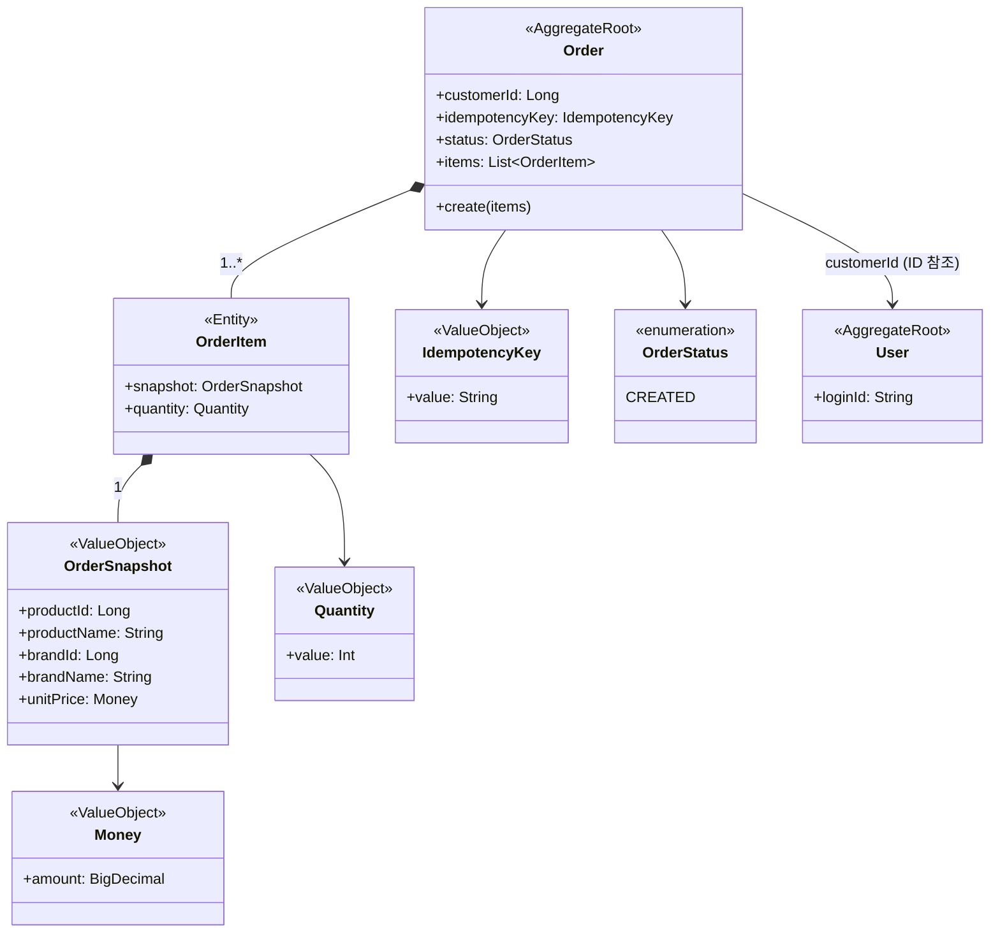

#### 본질적 책임

- **계약서 작성**: 구매 의사를 OrderItem과 OrderSnapshot으로 기록한다
- **주문 스냅샷 보존**: 주문 생성 시점의 상품/브랜드/가격 정보를 영구 보존한다
- **멱등성 보장**: idempotencyKey를 통해 동일 요청 중복 주문을 방지한다 (요구사항 5.2, 6.3)

#### True Invariant

- `items` 비어있지 않음 (주문 항목 없는 주문이 불가능하다)
- `idempotencyKey` 유일성 (동일 요청 ID로 중복 주문 생성이 불가능하다)

#### 재고 검증 미포함 근거

Order에 재고 검증 로직이 **없는** 이유:

- Order의 본질은 "계약서 작성"이며, **재고 확인은 계약서를 작성하기 위한 사전 조건**이다
- 재고 검증 방식은 애플리케이션 정책이다 (실시간 검증 vs 배치 검증 vs Saga 패턴 등 변경 가능)
- 따라서 재고 검증은 OrderDomainService가 담당한다 (섹션 4 참조)

#### OrderItem과 OrderSnapshot의 역할

- **OrderItem (Entity)**: 주문의 개별 항목을 구성하는 단위다. OrderSnapshot과 수량(Quantity)을 보유한다
- **OrderSnapshot (Value Object)**: 주문 시점의 불변 정보를 보존하는 구조 VO다
    - productId, productName, brandId, brandName, unitPrice(Money)를 포함한다
    - 이후 Product나 Brand 정보가 변경되어도 OrderSnapshot은 불변이다

#### 관계

- **Order → User (ID 참조)**: 주문 소유자 (customerId)를 참조한다
- **Order *-- OrderItem (Composition — 부모가 삭제되면 자식도 함께 삭제되는 강한 소속 관계)**: Aggregate 내부, 생명주기 종속 (1..*)
- **OrderItem *-- OrderSnapshot (Composition)**: VO, 생명주기 종속 (1)

#### 핵심 비즈니스 규칙 vs 구현 세부사항

| 핵심 비즈니스 규칙                   | 구현 세부사항                                    |
|------------------------------|--------------------------------------------|
| 계약서 작성 — 구매 의사를 항목과 스냅샷으로 기록 | 재고 검증 방식 (실시간 vs 배치 vs Saga)               |
| 주문 스냅샷 보존 (불변)               | 결제 정책 (결제 수단, 취소 규칙 등)                     |
| 멱등성 보장 (idempotencyKey)      | 주문 상태 전이 규칙 (CREATED → PAID → COMPLETED 등) |

---

## 4. Value Objects: 도메인 개념의 캡슐화

### 4.1 래퍼 VO (Wrapper Value Objects)

#### Money

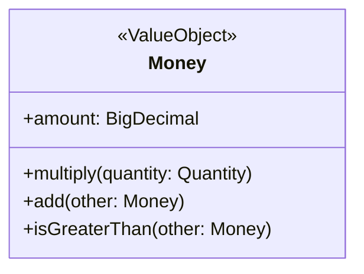

- **본질**: 금액이라는 도메인 개념을 캡슐화한다
- **불변식**: amount > 0 (음수 금액이 불가능하다)
- **행위**: multiply(quantity), add(other), isGreaterThan(other)
- **사용처**: Product.price, OrderSnapshot.unitPrice

#### Quantity

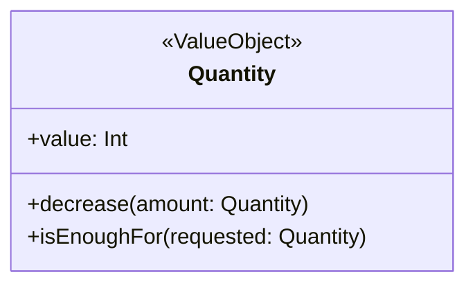

- **본질**: 수량이라는 도메인 개념을 캡슐화한다
- **불변식**: value >= 0 (재고), value > 0 (주문 수량)
- **행위**: decrease(amount), isEnoughFor(requested)
- **사용처**: ProductStock.quantity, OrderItem.quantity

#### Email

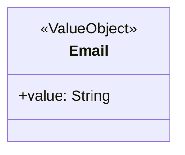

- **본질**: 이메일 주소 형식의 정합성을 보장한다
- **불변식**: 이메일 형식 검증 (RFC 5322)
- **사용처**: User.email

#### IdempotencyKey

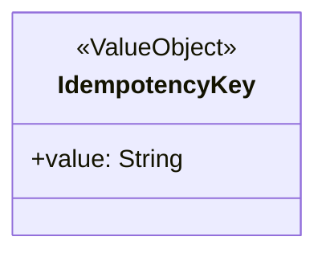

- **본질**: 요청의 고유성을 보장하여 중복 처리를 방지한다
- **유비쿼터스 언어**: "고유한 요청 식별자를 통해 멱등성을 보장한다"
- **사용처**: Order.idempotencyKey (요구사항 5.2, 6.3)

### 4.2 구조 VO (Structural Value Objects)

#### OrderSnapshot

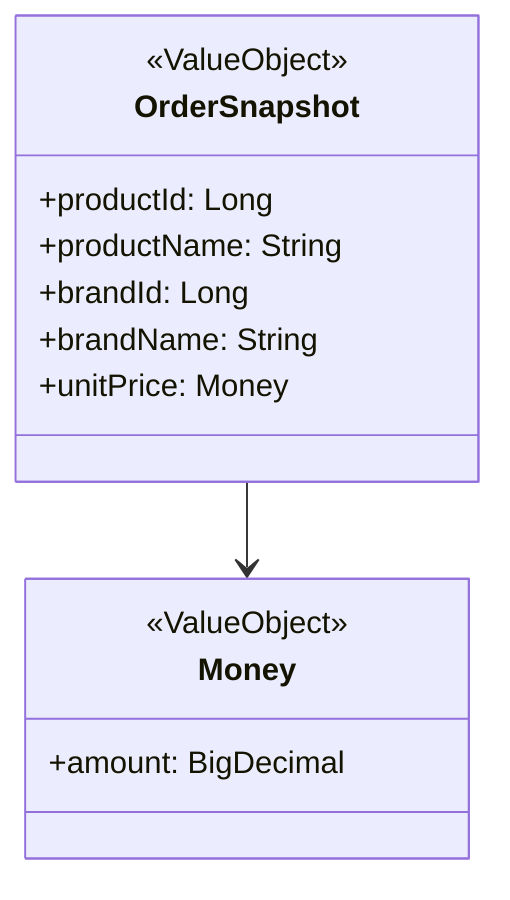

- **본질**: 주문 시점의 불변 정보를 보존한다 (계약서의 기록)
- **구성**: productId, productName, brandId, brandName, unitPrice(Money)
- **불변성**: 주문 생성 후 Product/Brand 정보가 변경되어도 스냅샷은 변경되지 않는다 (요구사항 5.3)

> **Value Object 정의**: VO는 고유 식별자(id) 없이, 한번 생성되면 내부 값이 바뀌지 않으며, 내부 값이 같으면 같은 것으로 취급하는 객체다. 단일 필드 래퍼(Money)도, 다중 필드 구조(OrderSnapshot, Address)도 모두 VO가 될 수 있다. 핵심은 **"무엇이냐"**가 아니라 **"값이 같으면 같은 것"**이라는
> 성질이다.

---

## 5. DomainService: 주문 생성 조율

### 5.1 OrderDomainService

#### 책임 범위

OrderDomainService는 여러 Aggregate(ProductStock, Order)에 걸친 주문 생성 비즈니스 규칙을 조율한다. 단일 Aggregate 내에서 해결할 수 없는 로직을 Domain Service로 분리한다.

#### 본질적 책임

OrderDomainService.createOrder()는 다음 순서로 주문 생성을 조율한다:

1. **상품 존재 여부 및 노출 상태 검증**: Product가 ACTIVE이고 삭제되지 않았는지 확인한다
2. **멱등성 검증**: IdempotencyKey 중복을 확인한다 (동일 요청 재시도 방지)
3. **재고 검증 및 차감**: ProductStock.decrease(amount)를 호출한다 (All-or-Nothing)
4. **주문 생성**: Order.create(items)를 호출한다

#### 핵심 비즈니스 규칙 vs 구현 세부사항

| 핵심 비즈니스 규칙                   | 구현 세부사항                          |
|------------------------------|----------------------------------|
| 주문 생성 = 계약서 작성               | 검증 순서 (상품 검증 → 재고 검증 순서 변경 가능)   |
| All-or-Nothing 원칙 (요구사항 5.2) | 실패 처리 전략 (즉시 롤백 vs Saga 보상 트랜잭션) |

#### 트랜잭션 전략과 Saga 전환 포인트

**현재 전략: 실용적 단일 트랜잭션**

- ProductStock 차감 + Order 생성을 동일 트랜잭션 내에서 처리한다
- Vaughn Vernon Rule 1 (한 트랜잭션에서 하나의 Aggregate만 수정) 의식적 예외
- 근거:
    - 학습 프로젝트 — 단순한 구현으로 DDD 개념 이해 우선
    - All-or-Nothing 요구사항 (요구사항 5.2) — 부분 주문 불가
    - ADR 문서화 — 의식적 결정임을 명시

**향후 전략: Saga 전환 포인트**

Saga 패턴이란, 여러 단계의 작업을 순차적으로 실행하되 중간에 실패하면 이전 단계를 보상(취소)하는 방식이다. 결제 기능 도입 시 다음과 같이 Saga 패턴으로 전환 가능하다:

1. **재고 예약** (ProductStock.reserve()) — Eventual Consistency(즉시가 아니라 약간의 지연을 허용하며 데이터 일관성을 맞추는 방식)
2. **주문 생성** (Order.create()) — Pending 상태
3. **결제 처리** (PaymentService) — 외부 API 호출
4. **성공 시**: 재고 확정(ProductStock.confirm()), 주문 완료(Order.complete())
5. **실패 시**: 재고 복구(ProductStock.release()), 주문 취소(Order.cancel())

---

## 6. 설계 결정 사항

### 결정 1: ProductStock을 Product에서 분리하여 별도 Aggregate

**결정 내용**

Product와 ProductStock을 별도 Aggregate로 분리하고, productId로 1:1 대응시킨다.

**DDD 근거**

- Product의 불변식: 카탈로그 정보 (name, price, brandId)
- ProductStock의 불변식: 재고 수량 (quantity >= 0)
- 두 불변식은 서로 독립적이다 — 상품명 변경과 재고 증감은 영향 없다
- Small Aggregate 원칙: Aggregate는 Root Entity + 최소 구성으로 작게 설계한다

**트레이드오프**

- 장점: 트랜잭션 경합 감소, 각 Aggregate 책임 명확
- 단점: 조회 시 Product와 ProductStock 조인 필요 (CQRS — 데이터를 변경하는 모델과 조회하는 모델을 분리하는 패턴으로 해결 가능)

---

### 결정 2: Order에서 재고 검증 로직 제외

**결정 내용**

Order 객체는 재고 검증 로직을 포함하지 않으며, OrderDomainService가 재고 검증을 담당한다.

**DDD 근거**

- Order의 본질: **"계약서 작성"** — 구매 의사를 항목과 스냅샷으로 기록
- 재고 검증: 계약서를 작성하기 위한 **사전 조건** (애플리케이션 레벨 비즈니스 정책)
- 재고 검증 방식은 변경 가능하다 (실시간 vs 배치 vs Saga) → 구현 세부사항

**트레이드오프**

- 장점: Order의 책임 명확, 재고 검증 전략 교체 용이
- 단점: OrderDomainService 의존성 추가

---

### 결정 3: OrderDomainService로 조율

**결정 내용**

ProductStock 차감 + Order 생성을 OrderDomainService가 조율한다.

**DDD 근거**

- 여러 Aggregate에 걸친 비즈니스 규칙 → Domain Service로 분리
- 한 트랜잭션에서 하나의 Aggregate만 수정하는 원칙의 의식적 예외:
    - ADR(Architecture Decision Record, 설계 결정 기록) 문서화: 학습 프로젝트 + All-or-Nothing 요구사항 (요구사항 5.2)
    - 트랜잭션 전략: 현재 동일 트랜잭션, 결제 도입 시 Saga 패턴으로 전환 가능

**트레이드오프**

- 장점: 구현 단순, All-or-Nothing 보장
- 단점: Aggregate 간 트랜잭션 의존성 (Saga로 해결 가능)

---

### 결정 4: OrderSnapshot을 OrderItem 내부 VO로 분리

**결정 내용**

주문 스냅샷을 OrderSnapshot VO로 명시적으로 분리한다.

**DDD 근거**

- 유비쿼터스 언어에서 "주문 스냅샷"을 명시적 용어로 정의한다
- Order의 본질(계약서)에서 **"시점 정보 보존"** 의 역할을 명확히 한다
- OrderItem은 "주문 항목", OrderSnapshot은 "불변 스냅샷" — 각각의 책임을 분리한다

**트레이드오프**

- 장점: 역할 명확, 요구사항 추적성 향상
- 단점: 클래스 수 증가 (하지만 복잡도 증가 없음)

---

### 결정 5: Brand와 Product를 별도 Aggregate

**결정 내용**

Brand와 Product를 별도 Aggregate로 분리하고, Product.brandId로 ID 참조한다.

**DDD 근거**

- 요구사항 5.5: "상품의 브랜드는 변경되지 않는다" → 불변 참조
- 독립적 lifecycle: 브랜드 정보 수정과 상품 정보 수정은 서로 독립적이다
- Aggregate 간에는 ID 값으로만 참조한다는 원칙을 따른다

**트레이드오프**

- 장점: 독립적 변경, 트랜잭션 경합 감소
- 단점: 브랜드 삭제 시 Product Cascade Delete 필요 (Application Service가 처리)

---

### 결정 6: ProductLike를 독립 Aggregate

**결정 내용**

ProductLike를 Product 내부가 아닌 독립 Aggregate로 분리한다.

**DDD 근거**

- Customer별 독립 관리 — Product는 자신을 좋아하는 Customer 목록을 알 필요가 없다
- 서로 다른 컨텍스트: Product는 "판매 단위", ProductLike는 "Customer 선호"

**트레이드오프**

- 장점: Product와 ProductLike 독립적 변경
- 단점: 좋아요 수 집계 시 ProductLike Aggregate 조회 필요 (CQRS로 해결 가능)

---

### 결정 7: Price를 Product 속성으로 유지

**결정 내용**

현재 범위에서는 Price를 별도 Aggregate로 분리하지 않고 Product.price(Money)로 유지한다.

**DDD 근거**

- 현재 요구사항: 단일 판매 단위, 가격 전략/이력 없다
- 가격 변동이 Product 정보 수정과 함께 발생한다 (독립적 변경 주기가 아니다)

**의식적 결정**

- 향후 확장 포인트: 가격 전략, 이력 관리, 프로모션 가격 등이 도입되면 Pricing Context 분리 가능
- ADR 문서화: "현재는 Product 속성, 향후 확장 시 Pricing Aggregate 검토"

---

### 결정 8: 트랜잭션 전략 - 실용적 단일 트랜잭션

**결정 내용**

ProductStock 차감 + Order 생성을 동일 트랜잭션 내에서 처리한다.

**DDD 근거**

- 한 트랜잭션에서 하나의 Aggregate만 수정하는 원칙의 의식적 예외
- 학습 프로젝트 — DDD 개념 이해가 우선, 복잡도 최소화
- All-or-Nothing 요구사항 (요구사항 5.2) — 부분 주문 불가

**의식적 결정**

- ADR 문서화: "왜 단일 트랜잭션을 선택했는가?"
- Saga 패턴 전환 포인트 마련: 결제 도입 시 Eventual Consistency + 보상 트랜잭션으로 전환 가능

**트레이드오프**

- 장점: 구현 단순, 정합성 보장 명확
- 단점: Aggregate 간 트랜잭션 의존성 (향후 Saga로 해결)

---

## 7. 요구사항 추적

### 비즈니스 규칙 → 도메인 요소 매핑

| 요구사항                   | 도메인 요소                           | 구현 방법                                                                                             |
|------------------------|----------------------------------|---------------------------------------------------------------------------------------------------|
| **5.1 노출 원칙**          | Brand.status, Product.status     | BrandStatus, ProductStatus Enumeration으로 활성/비활성을 관리한다. Customer 조회 시 ACTIVE + 미삭제만 노출한다           |
| **5.2 All-or-Nothing** | OrderDomainService.createOrder() | ProductStock.decrease() → 재고 부족 시 예외, 전체 롤백. IdempotencyKey로 중복을 방지한다                             |
| **5.3 스냅샷 보존**         | OrderSnapshot VO                 | 주문 생성 시점의 productName, brandName, unitPrice를 OrderSnapshot에 보존한다. 이후 Product/Brand 변경 시 영향 없다     |
| **5.4 접근 원칙**          | User, ProductLike, Order         | Customer는 본인 customerId와 일치하는 데이터만 조회/수정 가능하다 (Application Service에서 검증)                          |
| **5.5 브랜드-상품 종속**      | Product.brandId (불변)             | Product 생성 시 brandId를 설정하며, 이후 변경이 불가능하다. Brand 삭제 시 Product Cascade Delete (Application Service) |
| **6.3 멱등성**            | Order.idempotencyKey             | IdempotencyKey VO로 요청 고유성을 보장한다. OrderDomainService가 중복을 검증한다                                     |
