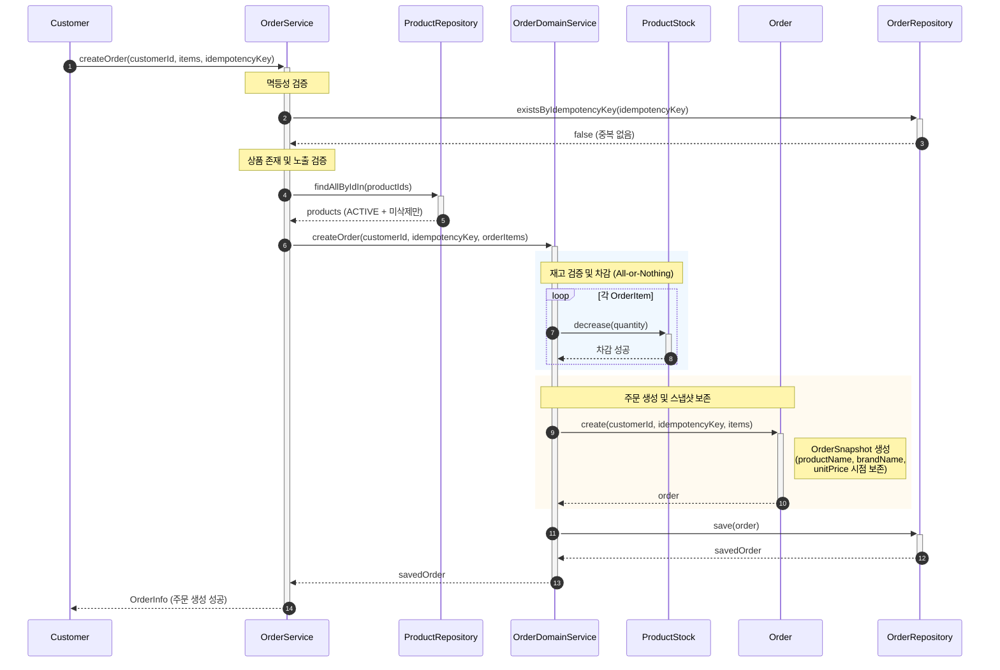
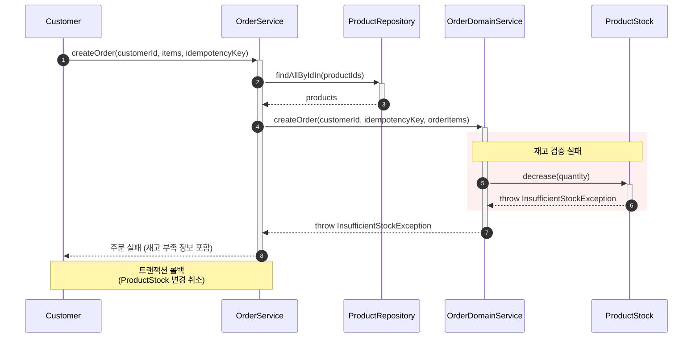
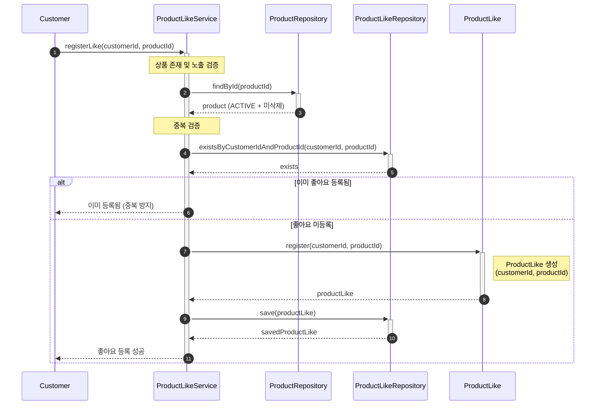
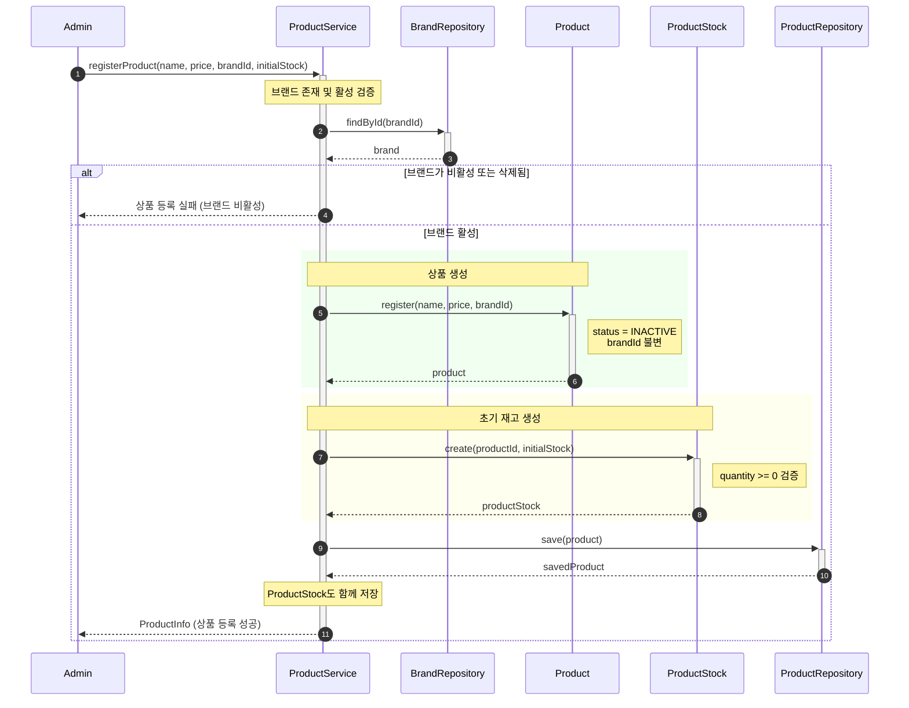
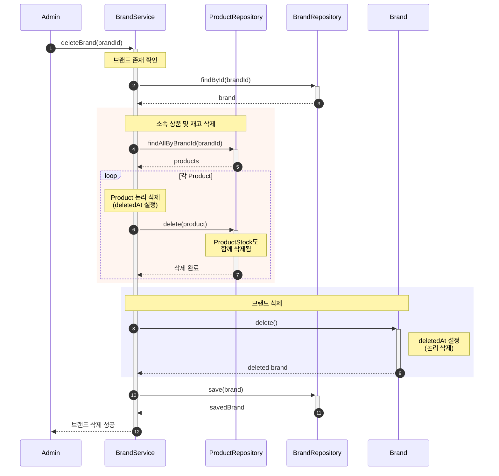

# 시퀀스 다이어그램

- **작성자**: 김민주
- **최종 수정일**: 2026-02-14

## 목차

- [1. 개요](#1-개요)
    - [1.1 문서 목적](#11-문서-목적)
    - [1.2 다이어그램 구성 전략](#12-다이어그램-구성-전략)
    - [1.3 참여자 표기 규칙](#13-참여자-표기-규칙)
- [2. Customer 시나리오](#2-customer-시나리오)
    - [2.1 주문 생성 (정상 흐름)](#21-주문-생성-정상-흐름)
    - [2.2 주문 생성 (재고 부족 예외 흐름)](#22-주문-생성-재고-부족-예외-흐름)
    - [2.3 좋아요 등록](#23-좋아요-등록)
- [3. Admin 시나리오](#3-admin-시나리오)
    - [3.1 상품 등록](#31-상품-등록)
    - [3.2 브랜드 삭제](#32-브랜드-삭제)
- [4. 요구사항 추적](#4-요구사항-추적)
    - [4.1 기능 요구사항 매핑](#41-기능-요구사항-매핑)
    - [4.2 비즈니스 규칙 매핑](#42-비즈니스-규칙-매핑)
    - [4.3 시나리오별 핵심 메시지](#43-시나리오별-핵심-메시지)
    - [4.4 트랜잭션 경계](#44-트랜잭션-경계)
- [5. 설계 원칙 준수 확인](#5-설계-원칙-준수-확인)
    - [5.1 Hexagonal Architecture](#51-hexagonal-architecture)
    - [5.2 DDD Aggregate 경계](#52-ddd-aggregate-경계)
    - [5.3 의존성 방향](#53-의존성-방향)
- [6. 향후 확장 시나리오](#6-향후-확장-시나리오)
- [부록: 메시지 유형 범례](#부록-메시지-유형-범례)

## 1. 개요

### 1.1 문서 목적

본 문서는 요구사항 정의서(`01-requirements.md`)와 클래스 다이어그램(`02-class-diagram.md`)을 기반으로, 주요 유스케이스의 시간 순서에 따른 메시지 교환을 시각화한다. 각 시나리오는 참여자(Actor, Service, Domain, Repository) 간의 협력을 통해 비즈니스 목표를 달성하는 과정을 보여준다.

### 1.2 다이어그램 구성 전략

- **한 다이어그램 = 한 시나리오**: 각 시퀀스 다이어그램은 하나의 구체적인 유스케이스를 표현한다
- **정상 흐름 우선**: 기본 성공 시나리오를 먼저 작성하고, 예외 흐름은 별도 다이어그램으로 분리한다
- **레이어 간 메시지 흐름 강조**: Controller → Service → Domain → Repository 계층 간의 메시지 흐름을 명확히 한다
- **비즈니스 의미 중심**: 기술 구현 세부사항보다 비즈니스 의도가 드러나는 메시지를 표현한다

### 1.3 참여자 표기 규칙

시퀀스 다이어그램의 참여자는 다음 순서로 좌에서 우로 배치한다:

```
Actor → Application Service → Domain Service → Domain (Aggregate Root) → Repository
```

| 참여자 유형                  | 표기 예시                              | 설명                       |
|-------------------------|------------------------------------|--------------------------|
| Actor                   | Customer, Admin                    | 시스템을 사용하는 주체             |
| Application Service     | OrderService, ProductService       | 유스케이스를 조율하는 애플리케이션 계층    |
| Domain Service          | OrderDomainService                 | 여러 Aggregate에 걸친 비즈니스 규칙 |
| Domain (Aggregate Root) | Order, Product, ProductStock       | 도메인 모델 (불변식 보호)          |
| Repository              | OrderRepository, ProductRepository | 영속성 추상화                  |

**주의사항**:

- Aggregate 내부 Entity(OrderItem 등)는 참여자로 표시하지 않는다
- Repository는 인터페이스(도메인 계층)를 표현하며, 구현 세부사항(JPA)은 숨긴다

---

## 2. Customer 시나리오

### 2.1 주문 생성 (정상 흐름)

#### 시나리오 개요

Customer가 여러 상품을 주문하고, 시스템이 재고를 검증한 후 주문을 생성하는 정상 흐름이다. 이 과정에서 OrderDomainService가 ProductStock 차감과 Order 생성을 조율한다.

#### 시퀀스 다이어그램



#### 설계 포인트

| 포인트                       | 설명                                                | 근거                                 |
|---------------------------|---------------------------------------------------|------------------------------------|
| **멱등성 보장**                | IdempotencyKey로 중복 주문을 방지한다                       | 요구사항 5.2, 6.3 (네트워크 재시도 대응)        |
| **OrderDomainService 조율** | ProductStock 차감과 Order 생성을 단일 트랜잭션 내에서 조율한다       | 클래스 다이어그램 섹션 5.1 (여러 Aggregate 조율) |
| **All-or-Nothing**        | 모든 상품의 재고가 확보되어야만 주문이 생성된다                        | 요구사항 5.2 (부분 주문 불가)                |
| **OrderSnapshot 보존**      | 주문 생성 시점의 상품/브랜드/가격 정보를 OrderSnapshot VO에 영구 보존한다 | 요구사항 5.3 (이후 상품 정보 변경 시 영향 없음)     |
| **노출 검증**                 | ACTIVE이고 삭제되지 않은 상품만 주문 가능하다                      | 요구사항 5.1 (노출 원칙)                   |

---

### 2.2 주문 생성 (재고 부족 예외 흐름)

#### 시나리오 개요

Customer가 주문을 시도했으나, 일부 상품의 재고가 부족하여 주문 전체가 실패하는 예외 흐름이다. ProductStock.decrease()에서 예외가 발생하면, 트랜잭션 전체가 롤백된다.

#### 시퀀스 다이어그램



#### 설계 포인트

| 포인트           | 설명                                                                        | 근거                         |
|---------------|---------------------------------------------------------------------------|----------------------------|
| **예외 전파**     | ProductStock에서 발생한 예외가 OrderDomainService → OrderService → Customer로 전파된다 | 계층 간 예외 전파 원칙              |
| **트랜잭션 롤백**   | 재고 부족 시 이미 차감된 재고도 함께 롤백된다                                                | 요구사항 5.2 (All-or-Nothing)  |
| **Order 미생성** | 재고 검증 실패 시 Order 객체가 생성되지 않는다                                             | 도메인 불변식 보호 (유효하지 않은 주문 방지) |
| **부족 정보 반환**  | 예외에는 부족한 상품과 주문 가능 수량 정보가 포함된다                                            | 요구사항 5.2 (재고 부족 시 정보 제공)   |

---

### 2.3 좋아요 등록

#### 시나리오 개요

Customer가 특정 상품에 대해 좋아요를 등록한다. 상품 존재 여부를 검증한 후, ProductLike Aggregate를 생성한다.

#### 시퀀스 다이어그램



#### 설계 포인트

| 포인트              | 설명                                          | 근거                                |
|------------------|---------------------------------------------|-----------------------------------|
| **상품 존재 검증**     | 존재하지 않는 상품에 대한 좋아요는 등록할 수 없다                | 요구사항 4.2 (예외 흐름)                  |
| **노출 검증**        | ACTIVE이고 삭제되지 않은 상품만 좋아요 등록 가능하다            | 요구사항 5.1 (노출 원칙)                  |
| **중복 방지**        | (customerId, productId) 쌍의 유일성을 검증한다        | 클래스 다이어그램 섹션 3.5 (True Invariant) |
| **독립 Aggregate** | ProductLike는 Product에 종속되지 않는 독립 Aggregate다 | 클래스 다이어그램 섹션 3.5 (독립 lifecycle)   |

---

## 3. Admin 시나리오

### 3.1 상품 등록

#### 시나리오 개요

Admin이 새로운 상품을 등록한다. 브랜드 존재 및 활성 여부를 검증한 후, Product와 ProductStock을 함께 생성한다.

#### 시퀀스 다이어그램



#### 설계 포인트

| 포인트            | 설명                                                       | 근거                                |
|----------------|----------------------------------------------------------|-----------------------------------|
| **브랜드 종속**     | 상품은 반드시 하나의 브랜드에 소속되며, 브랜드가 활성 상태여야 한다                   | 요구사항 5.5 (브랜드-상품 종속 원칙)           |
| **brandId 불변** | 상품 생성 시 brandId가 설정되며, 이후 변경되지 않는다                       | 클래스 다이어그램 섹션 3.3 (True Invariant) |
| **초기 재고 생성**   | Product 생성 시 ProductStock도 함께 생성된다 (1:1 대응)              | 클래스 다이어그램 섹션 3.4 (관계)             |
| **비활성 상태 기본값** | 상품 등록 시 status는 기본적으로 INACTIVE이다 (Admin이 명시적으로 활성화해야 노출) | 도메인 모델 설계 (명시적 활성화 필요)            |

---

### 3.2 브랜드 삭제

#### 시나리오 개요

Admin이 브랜드를 삭제한다. 브랜드에 속한 모든 상품과 재고가 함께 삭제된다(Cascade Delete).

#### 시퀀스 다이어그램



#### 설계 포인트

| 포인트                        | 설명                                                 | 근거                                          |
|----------------------------|----------------------------------------------------|---------------------------------------------|
| **Cascade Delete**         | 브랜드 삭제 시 소속 상품과 재고가 함께 삭제된다                        | 요구사항 5.5 (브랜드-상품 종속 원칙)                     |
| **논리 삭제**                  | 물리적 삭제가 아닌 deletedAt 설정을 통한 논리 삭제다                 | 유비쿼터스 언어 4.2 (Logical Delete)               |
| **ProductStock 연쇄 삭제**     | Product 삭제 시 ProductStock도 함께 삭제된다 (1:1 대응)        | 클래스 다이어그램 섹션 3.4 (관계)                       |
| **Application Service 책임** | Cascade Delete는 BrandService(Application 계층)가 조율한다 | 클래스 다이어그램 설계 결정 5 (Application Service가 처리) |
| **삭제 후 노출 차단**             | 삭제된 브랜드와 상품은 Customer 조회에서 노출되지 않는다                | 요구사항 5.1 (노출 원칙)                            |

---

## 4. 요구사항 추적

본 시퀀스 다이어그램이 커버하는 요구사항과 비즈니스 규칙을 추적한다.

### 4.1 기능 요구사항 매핑

| 요구사항                    | 커버 시나리오                           | 참여자                                                                                                  |
|-------------------------|-----------------------------------|------------------------------------------------------------------------------------------------------|
| **4.2 좋아요 관리**          | 2.3 좋아요 등록                        | Customer, ProductLikeService, ProductRepository, ProductLikeRepository, ProductLike                  |
| **4.3 주문 생성**           | 2.1 주문 생성 (정상), 2.2 주문 생성 (재고 부족) | Customer, OrderService, ProductRepository, OrderDomainService, ProductStock, Order, OrderRepository  |
| **4.4 Admin 브랜드/상품 관리** | 3.1 상품 등록, 3.2 브랜드 삭제             | Admin, ProductService/BrandService, BrandRepository, ProductRepository, Product, ProductStock, Brand |

### 4.2 비즈니스 규칙 매핑

| 비즈니스 규칙                | 구현 위치                                                      | 시퀀스 다이어그램 표현                                     |
|------------------------|------------------------------------------------------------|--------------------------------------------------|
| **5.1 노출 원칙**          | ProductRepository.findAllByIdIn()                          | 2.1 (상품 노출 검증), 2.3 (상품 노출 검증), 3.2 (삭제 후 노출 차단) |
| **5.2 All-or-Nothing** | OrderDomainService.createOrder() + ProductStock.decrease() | 2.1 (재고 차감 loop), 2.2 (트랜잭션 롤백)                  |
| **5.3 주문 스냅샷 보존**      | Order.create()                                             | 2.1 (OrderSnapshot 생성 Note)                      |
| **5.4 접근 원칙**          | Service 계층 customerId 검증                                   | 2.1, 2.2, 2.3 (customerId 파라미터)                  |
| **5.5 브랜드-상품 종속**      | Product.register() + BrandService.deleteBrand()            | 3.1 (브랜드 검증), 3.2 (Cascade Delete)               |
| **6.3 멱등성**            | OrderRepository.existsByIdempotencyKey()                   | 2.1 (멱등성 검증)                                     |

### 4.3 시나리오별 핵심 메시지

| 시나리오                  | 핵심 메시지                                                                      | 비즈니스 의미                                          |
|-----------------------|-----------------------------------------------------------------------------|--------------------------------------------------|
| **2.1 주문 생성 (정상)**    | OrderDomainService.createOrder() → ProductStock.decrease() → Order.create() | 재고 차감과 주문 생성을 단일 트랜잭션 내에서 조율하여 All-or-Nothing 보장 |
| **2.2 주문 생성 (재고 부족)** | ProductStock.decrease() → throw InsufficientStockException                  | 재고 부족 시 예외 발생으로 전체 트랜잭션 롤백                       |
| **2.3 좋아요 등록**        | ProductRepository.findById() → ProductLike.register()                       | 상품 존재 검증 후 독립 Aggregate 생성                       |
| **3.1 상품 등록**         | BrandRepository.findById() → Product.register() → ProductStock.create()     | 브랜드 검증 후 상품과 초기 재고 생성                            |
| **3.2 브랜드 삭제**        | ProductRepository.findAllByBrandId() → Brand.delete()                       | Cascade Delete를 Application Service가 조율          |

### 4.4 트랜잭션 경계

각 시퀀스 다이어그램의 트랜잭션 경계는 Application Service 메서드 단위로 설정된다:

| 시나리오              | 트랜잭션 시작                           | 트랜잭션 종료                            |
|-------------------|-----------------------------------|------------------------------------|
| 2.1 주문 생성 (정상)    | OrderService.createOrder()        | OrderRepository.save() 완료          |
| 2.2 주문 생성 (재고 부족) | OrderService.createOrder()        | InsufficientStockException 발생 시 롤백 |
| 2.3 좋아요 등록        | ProductLikeService.registerLike() | ProductLikeRepository.save() 완료    |
| 3.1 상품 등록         | ProductService.registerProduct()  | ProductRepository.save() 완료        |
| 3.2 브랜드 삭제        | BrandService.deleteBrand()        | BrandRepository.save() 완료          |

---

## 5. 설계 원칙 준수 확인

### 5.1 DDD Layered Architecture

모든 시퀀스 다이어그램은 DDD의 계층 구조를 따른다:

```
Actor → Application Service → Domain Service → Domain (Aggregate Root) → Repository (인터페이스)
```

- **Application Service**: 유스케이스 조율 (OrderService, ProductLikeService, ProductService, BrandService)
- **Domain Service**: 여러 Aggregate 간 비즈니스 규칙 (OrderDomainService)
- **Domain**: 불변식 보호 및 비즈니스 로직 (Order, ProductStock, ProductLike, Product, Brand)
- **Repository**: 영속성 추상화 (도메인 계층 인터페이스)

**참고**: 본 문서는 DDD Layered Architecture의 계층 간 메시지 흐름을 표현하며, Hexagonal Architecture의 Port/Adapter 구조는 다루지 않는다.

### 5.2 DDD Aggregate 경계

각 시퀀스 다이어그램은 Aggregate 경계를 존중한다:

- **Order Aggregate**: OrderItem, OrderSnapshot은 참여자로 표시하지 않음 (내부 Entity/VO)
- **ProductStock Aggregate**: Product와 별도 Aggregate로 취급 (독립적 트랜잭션 경계)
- **ProductLike Aggregate**: Product에 종속되지 않는 독립 Aggregate

### 5.3 의존성 방향

모든 메시지 흐름은 의존성 규칙을 따른다:

```
interfaces → application → domain ← infrastructure
```

- Repository는 도메인 계층 인터페이스로 표현
- Infrastructure(JpaRepository 구현)는 다이어그램에서 숨김
- Domain은 외부 계층을 알지 못함 (순수성 유지)

---

## 6. 향후 확장 시나리오

현재 범위(In Scope)에서 제외되었으나, 향후 확장 시 추가될 시퀀스 다이어그램:

| 확장 기능         | 추가 시나리오                   | 핵심 참여자                                                         |
|---------------|---------------------------|----------------------------------------------------------------|
| **결제 처리**     | 주문 생성 → 결제 요청 → 결제 완료     | Customer, PaymentService, OrderService, ExternalPaymentGateway |
| **미결제 자동 취소** | 주문 조회 → 시간 초과 검증 → 재고 복구  | BatchScheduler, OrderService, ProductStock                     |
| **쿠폰 적용**     | 주문 생성 시 쿠폰 검증 → 할인 적용     | Customer, CouponService, OrderService                          |
| **장바구니**      | 장바구니 담기 → 장바구니 조회 → 주문 생성 | Customer, CartService, OrderService                            |

---

## 부록: 메시지 유형 범례

본 문서의 시퀀스 다이어그램에서 사용하는 Mermaid 메시지 표기법:

| 표기법                    | 의미                       | 사용 예시                       |
|------------------------|--------------------------|-----------------------------|
| `A->>B: message`       | 동기 호출 (Synchronous Call) | Service → Repository 메서드 호출 |
| `A-->>B: return`       | 반환 메시지 (Reply)           | Repository → Service 결과 반환  |
| `Note over A,B: text`  | 설명 노트                    | 비즈니스 의미나 기술 세부사항 설명         |
| `rect rgb(r,g,b)`      | 논리적 그룹핑                  | 관련 메시지들을 시각적으로 묶음           |
| `alt ... else ... end` | 조건 분기 (Alternative)      | 성공/실패 흐름 분기                 |
| `loop ... end`         | 반복 (Loop)                | 여러 항목 처리 반복                 |
