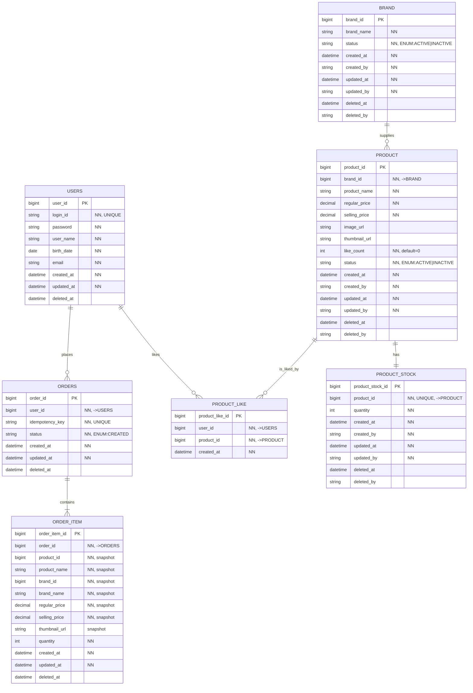

# ERD (Entity-Relationship Diagram)

- **작성자**: 김민주
- **최종 수정일**: 2026-02-14

## 목차

1. [개요](#1-개요)
    - [1.1 문서 목적](#11-문서-목적)
    - [1.2 설계 원칙](#12-설계-원칙)
2. [전체 ERD](#2-전체-erd)
3. [공통 컬럼 정의](#3-공통-컬럼-정의)
    - [3.1 BaseEntity 패턴](#31-baseentity-패턴)
    - [3.2 AdminAudit 패턴 (관리자 행위 추적)](#32-adminaudit-패턴-관리자-행위-추적)
    - [3.3 PRODUCT_LIKE 예외](#33-product_like-예외)
4. [테이블별 상세 설계](#4-테이블별-상세-설계)
    - [4.1 USER](#41-user)
    - [4.2 BRAND](#42-brand)
    - [4.3 PRODUCT](#43-product)
    - [4.4 PRODUCT_STOCK](#44-product_stock)
    - [4.5 PRODUCT_LIKE](#45-product_like)
    - [4.6 ORDERS](#46-orders)
    - [4.7 ORDER_ITEM](#47-order_item)
5. [설계 결정 사항](#5-설계-결정-사항)
    - [결정 1: FK 제약조건 미사용](#결정-1-fk-제약조건-미사용)
    - [결정 2: ORDER_ITEM 스냅샷 비정규화](#결정-2-order_item-스냅샷-비정규화)
    - [결정 3: PRODUCT.like_count 역정규화](#결정-3-productlike_count-역정규화)
    - [결정 4: PRODUCT_LIKE Hard Delete](#결정-4-product_like-hard-delete)
    - [결정 5: 가격 이원화 (regular_price, selling_price)](#결정-5-가격-이원화-regular_price-selling_price)
    - [결정 6: Admin 감사 컬럼 (created_by, updated_by, deleted_by)](#결정-6-admin-감사-컬럼-created_by-updated_by-deleted_by)
    - [결정 7: 테이블명/컬럼명 네이밍 규칙](#결정-7-테이블명컬럼명-네이밍-규칙)
6. [인덱스 전략](#6-인덱스-전략)
    - [6.1 UNIQUE 제약 (암묵적 인덱스)](#61-unique-제약-암묵적-인덱스)
    - [6.2 추가 권장 인덱스](#62-추가-권장-인덱스)
    - [6.3 복합 인덱스 (조회 빈도 기반)](#63-복합-인덱스-조회-빈도-기반)
7. [요구사항 추적 매핑](#7-요구사항-추적-매핑)
8. [부록: Mermaid 제약 보완](#8-부록-mermaid-제약-보완)

---

## 1. 개요

### 1.1 문서 목적

본 문서는 클래스 다이어그램(`02-class-diagram.md`)의 도메인 모델을 데이터베이스 설계로 전환한 Logical ERD이다. DDD Aggregate 경계를 유지하면서, 실제 데이터 저장을 위한 테이블 구조, 컬럼, 관계를 정의한다.

### 1.2 설계 원칙

**논리적 ERD 수준**

- 논리적 데이터 타입(`string`, `bigint`, `datetime`) 사용
- DBMS 종속 타입(`VARCHAR(255)`, `TIMESTAMP`) 제외
- 인덱스는 별도 섹션으로 분리

**3NF 기본 + 의도적 비정규화**

- 기본적으로 제3정규형(3NF)을 따른다
- 성능/비즈니스 요구사항에 따른 비정규화는 근거와 함께 문서화한다

**DDD Aggregate 반영**

- Aggregate Root만 외부 테이블에서 FK로 참조 가능하다
- Aggregate 내부 Entity는 Root에 대한 lifecycle 종속성을 갖는다

**참조 무결성 전략**

- ERD에서는 논리적 관계를 표현하되, 실제 DB에는 FK 제약조건을 걸지 않는다
- 애플리케이션 레벨에서 참조 무결성을 관리한다

---

## 2. 전체 ERD

---

## 3. 공통 컬럼 정의

### 3.1 BaseEntity 패턴

대부분의 테이블은 다음 공통 컬럼을 보유한다 (JPA `BaseEntity` 상속):

| 컬럼명          | 데이터 타입     | 제약조건               | 설명                    |
|--------------|------------|--------------------|-----------------------|
| `{table}_id` | `bigint`   | PK, AUTO_INCREMENT | 테이블별 고유 식별자           |
| `created_at` | `datetime` | NOT NULL           | 생성 시각 (타임존 포함)        |
| `updated_at` | `datetime` | NOT NULL           | 최종 수정 시각 (타임존 포함)     |
| `deleted_at` | `datetime` | NULL               | 논리 삭제 시각 (NULL = 미삭제) |

> **Soft Delete 패턴**: `deleted_at`이 NULL이면 활성 레코드, 값이 있으면 논리 삭제된 레코드이다.

### 3.2 AdminAudit 패턴 (관리자 행위 추적)

BRAND, PRODUCT, PRODUCT_STOCK 테이블은 Admin 감사 컬럼을 추가로 보유한다:

| 컬럼명          | 데이터 타입   | 제약조건     | 설명                       |
|--------------|----------|----------|--------------------------|
| `created_by` | `string` | NOT NULL | 생성자 (Admin LDAP 헤더 값)    |
| `updated_by` | `string` | NOT NULL | 최종 수정자 (Admin LDAP 헤더 값) |
| `deleted_by` | `string` | NULL     | 삭제자 (Admin LDAP 헤더 값)    |

> **감사 컬럼 순서**: `created_at` → `created_by` → `updated_at` → `updated_by` → `deleted_at` → `deleted_by` (시간-행위자 쌍으로 정렬)

### 3.3 PRODUCT_LIKE 예외

PRODUCT_LIKE는 **Hard Delete** 방식을 사용하므로, `created_at`만 보유하고 `updated_at`/`deleted_at`은 없다.

---

## 4. 테이블별 상세 설계

### 4.1 USER

**책임**: Customer(고객)의 신원 관리

**컬럼 상세**:

| 컬럼명          | 데이터 타입     | 제약조건             | 설명                |
|--------------|------------|------------------|-------------------|
| `user_id`    | `bigint`   | PK               | 사용자 고유 ID         |
| `login_id`   | `string`   | NOT NULL, UNIQUE | 로그인 식별자 (중복 불가)   |
| `password`   | `string`   | NOT NULL         | 암호화된 비밀번호         |
| `user_name`  | `string`   | NOT NULL         | 사용자명              |
| `birth_date` | `date`     | NOT NULL         | 생년월일              |
| `email`      | `string`   | NOT NULL         | 이메일 주소 (Email VO) |
| `created_at` | `datetime` | NOT NULL         |                   |
| `updated_at` | `datetime` | NOT NULL         |                   |
| `deleted_at` | `datetime` | NULL             |                   |

**불변식 (Invariants)**:

- `login_id` 유일성: 시스템 내에서 중복될 수 없다
- `email` 형식 검증: 애플리케이션 레벨에서 보장한다

**설계 노트**:

- USERS 테이블은 Customer만 관리한다. Admin은 회원가입 없이 LDAP 헤더 값으로 인증하므로 별도 테이블이 없다
- Soft Delete 지원: 탈퇴한 사용자도 `deleted_at`으로 이력 보존한다

---

### 4.2 BRAND

**책임**: 상품의 정체성을 부여하는 브랜드 정보 관리

**컬럼 상세**:

| 컬럼명          | 데이터 타입     | 제약조건     | 설명                         |
|--------------|------------|----------|----------------------------|
| `brand_id`   | `bigint`   | PK       | 브랜드 고유 ID                  |
| `brand_name` | `string`   | NOT NULL | 브랜드명                       |
| `status`     | `string`   | NOT NULL | ENUM: `ACTIVE`, `INACTIVE` |
| `created_at` | `datetime` | NOT NULL |                            |
| `created_by` | `string`   | NOT NULL | 생성 Admin                   |
| `updated_at` | `datetime` | NOT NULL |                            |
| `updated_by` | `string`   | NOT NULL | 최종 수정 Admin                |
| `deleted_at` | `datetime` | NULL     |                            |
| `deleted_by` | `string`   | NULL     | 삭제 Admin                   |

**불변식 (Invariants)**:

- `brand_name` 필수: 브랜드명 없이는 정체성 부여가 불가능하다
- 브랜드 삭제 시 소속 상품도 함께 논리 삭제된다 (요구사항 5.5 - Cascade Soft Delete)

**설계 노트**:

- `status` ENUM: Customer 노출 여부를 결정한다
    - `ACTIVE`: Customer 조회 가능
    - `INACTIVE`: Customer 조회 불가
- Admin 감사 컬럼으로 브랜드 관리 이력을 추적한다

---

### 4.3 PRODUCT

**책임**: 판매 단위의 카탈로그 정보 관리

**컬럼 상세**:

| 컬럼명             | 데이터 타입     | 제약조건     | 설명                         |
|-----------------|------------|----------|----------------------------|
| `product_id`    | `bigint`   | PK       | 상품 고유 ID                   |
| `brand_id`      | `bigint`   | NOT NULL | →BRAND (논리적 참조)            |
| `product_name`  | `string`   | NOT NULL | 상품명                        |
| `regular_price` | `decimal`  | NOT NULL | 정상가                        |
| `selling_price` | `decimal`  | NOT NULL | 판매가                        |
| `image_url`     | `string`   | NULL     | 대표 이미지 URL                 |
| `thumbnail_url` | `string`   | NULL     | 썸네일 이미지 URL                |
| `like_count`    | `int`      | NOT NULL | 좋아요 수 (역정규화, 기본값 0)        |
| `status`        | `string`   | NOT NULL | ENUM: `ACTIVE`, `INACTIVE` |
| `created_at`    | `datetime` | NOT NULL |                            |
| `created_by`    | `string`   | NOT NULL | 생성 Admin                   |
| `updated_at`    | `datetime` | NOT NULL |                            |
| `updated_by`    | `string`   | NOT NULL | 최종 수정 Admin                |
| `deleted_at`    | `datetime` | NULL     |                            |
| `deleted_by`    | `string`   | NULL     | 삭제 Admin                   |

**불변식 (Invariants)**:

- `product_name`, `regular_price`, `selling_price` 필수
- `brand_id` 불변: 상품의 브랜드는 생성 후 변경되지 않는다 (요구사항 5.5)
- 브랜드가 노출되지 않으면 상품도 노출되지 않는다 (요구사항 5.1)

**설계 노트**:

- **가격 이원화**: `regular_price`(정상가)와 `selling_price`(판매가)를 분리하여 할인/프로모션 표시를 지원한다
- **역정규화 컬럼 `like_count`**: PRODUCT_LIKE 테이블을 COUNT하는 대신 PRODUCT에 직접 저장하여 조회 성능을 확보한다
    - 좋아요 등록/취소 시 애플리케이션에서 `like_count`를 증감하지 않는다
    - 일관성 유지는 스케줄러를 통한 비동기 업데이트로 보장한다 (Eventual Consistency)
- `brand_id`는 논리적 참조이며, FK 제약조건은 걸지 않는다

---

### 4.4 PRODUCT_STOCK

**책임**: 상품별 재고 수량 관리 및 정합성 보장

**컬럼 상세**:

| 컬럼명                | 데이터 타입     | 제약조건             | 설명                |
|--------------------|------------|------------------|-------------------|
| `product_stock_id` | `bigint`   | PK               | 재고 고유 ID          |
| `product_id`       | `bigint`   | NOT NULL, UNIQUE | →PRODUCT (1:1 매핑) |
| `quantity`         | `int`      | NOT NULL         | 재고 수량 (≥ 0)       |
| `created_at`       | `datetime` | NOT NULL         |                   |
| `created_by`       | `string`   | NOT NULL         | 생성 Admin          |
| `updated_at`       | `datetime` | NOT NULL         |                   |
| `updated_by`       | `string`   | NOT NULL         | 최종 수정 Admin       |
| `deleted_at`       | `datetime` | NULL             |                   |
| `deleted_by`       | `string`   | NULL             | 삭제 Admin          |

**불변식 (Invariants)**:

- **`quantity >= 0`**: 재고는 절대 음수가 될 수 없다 (동시성 제어 필요, 요구사항 6.3)
- **`product_id` UNIQUE**: Product와 1:1 대응한다

**설계 노트**:

- **Product 분리 이유**: Product(카탈로그)와 ProductStock(재고)은 서로 다른 불변식을 가진다
    - Product 수정 트랜잭션과 재고 증감 트랜잭션의 경합을 줄인다
    - Small Aggregate 원칙 준수
- **동시성 제어**: 주문 생성 시 재고 차감은 Pessimistic Lock 또는 Optimistic Lock으로 보호한다

---

### 4.5 PRODUCT_LIKE

**책임**: Customer의 상품 선호 표시 및 저장

**컬럼 상세**:

| 컬럼명               | 데이터 타입     | 제약조건     | 설명               |
|-------------------|------------|----------|------------------|
| `product_like_id` | `bigint`   | PK       | 좋아요 고유 ID        |
| `user_id`         | `bigint`   | NOT NULL | →USER (Customer) |
| `product_id`      | `bigint`   | NOT NULL | →PRODUCT         |
| `created_at`      | `datetime` | NOT NULL | 좋아요 등록 시각        |

**UNIQUE 제약**: `(user_id, product_id)` — 중복 좋아요 방지

**불변식 (Invariants)**:

- `(user_id, product_id)` 쌍의 유일성: Customer는 동일 상품에 중복 좋아요를 등록할 수 없다
- 존재하지 않는 상품에 대한 좋아요 등록이 불가능하다 (요구사항 4.2)

**설계 노트**:

- **Hard Delete**: 좋아요 취소 시 물리 삭제한다
    - `updated_at`, `deleted_at` 컬럼이 없다
    - 좋아요 이력은 비즈니스적으로 불필요하다고 판단
- `PRODUCT.like_count`는 스케줄러를 통해 주기적으로 동기화한다 (Eventual Consistency)

---

### 4.6 ORDERS

**책임**: Customer의 구매 의사를 계약서로 기록

**컬럼 상세**:

| 컬럼명               | 데이터 타입     | 제약조건             | 설명               |
|-------------------|------------|------------------|------------------|
| `order_id`        | `bigint`   | PK               | 주문 고유 ID         |
| `user_id`         | `bigint`   | NOT NULL         | →USER (Customer) |
| `idempotency_key` | `string`   | NOT NULL, UNIQUE | 멱등성 키            |
| `status`          | `string`   | NOT NULL         | ENUM: `CREATED`  |
| `created_at`      | `datetime` | NOT NULL         |                  |
| `updated_at`      | `datetime` | NOT NULL         |                  |
| `deleted_at`      | `datetime` | NULL             |                  |

**불변식 (Invariants)**:

- `idempotency_key` 유일성: 동일 요청 ID로 중복 주문 생성이 불가능하다 (요구사항 5.2, 6.3)

**설계 노트**:

- **주문의 본질**: "계약서 작성" — 구매 의사를 ORDER_ITEM과 스냅샷으로 기록한다
- **멱등성 보장**: 동일 `idempotency_key`로 재시도 시 중복 주문을 생성하지 않는다
    - UNIQUE 제약으로 DB 레벨에서 방어한다
    - 애플리케이션은 기존 주문을 반환한다
- **주문 상태**:
    - `CREATED`: 주문이 생성되어 시스템에 기록된 상태 (현재 유일한 상태)
    - 향후 결제 도입 시 `PAID`, `CANCELLED` 등으로 확장 가능하다 (요구사항 7)

---

### 4.7 ORDER_ITEM

**책임**: 주문의 개별 항목 및 주문 시점 스냅샷 보존

**컬럼 상세**:

| 컬럼명             | 데이터 타입     | 제약조건     | 설명                     |
|-----------------|------------|----------|------------------------|
| `order_item_id` | `bigint`   | PK       | 주문 항목 고유 ID            |
| `order_id`      | `bigint`   | NOT NULL | →ORDERS (Aggregate 내부) |
| `product_id`    | `bigint`   | NOT NULL | 상품 ID (스냅샷)            |
| `product_name`  | `string`   | NOT NULL | 상품명 (스냅샷)              |
| `brand_id`      | `bigint`   | NOT NULL | 브랜드 ID (스냅샷)           |
| `brand_name`    | `string`   | NOT NULL | 브랜드명 (스냅샷)             |
| `regular_price` | `decimal`  | NOT NULL | 정상가 (스냅샷)              |
| `selling_price` | `decimal`  | NOT NULL | 판매가 (스냅샷)              |
| `thumbnail_url` | `string`   | NULL     | 썸네일 이미지 URL (스냅샷)      |
| `quantity`      | `int`      | NOT NULL | 주문 수량                  |
| `created_at`    | `datetime` | NOT NULL |                        |
| `updated_at`    | `datetime` | NOT NULL |                        |
| `deleted_at`    | `datetime` | NULL     |                        |

**불변식 (Invariants)**:

- 주문 항목은 비어있을 수 없다: 최소 1개 이상의 ORDER_ITEM이 존재한다

**설계 노트**:

- **스냅샷 비정규화 (요구사항 5.3)**:
    - `product_id`, `product_name`, `brand_id`, `brand_name`, `regular_price`, `selling_price`, `thumbnail_url`을 ORDER_ITEM에 직접 저장한다
    - 주문 생성 후 Product/Brand 정보가 변경되어도 스냅샷은 불변이다
- **`product_id`는 FK가 아님**:
    - Product 삭제 후에도 주문 이력을 보존하기 위해 논리적 참조만 한다
    - 참조 무결성 제약을 걸지 않는다
- **가격 2종 저장**: 정상가/판매가 모두 스냅샷으로 저장하여 주문 내역에서 "정상가 → 판매가" 할인 이력을 표시할 수 있다

---

## 5. 설계 결정 사항

### 결정 1: FK 제약조건 미사용

**결정 내용**

ERD에서는 논리적 관계를 표현하되, 실제 DB에는 FK(Foreign Key) 제약조건을 걸지 않는다.

**근거**

- **유연성**: 애플리케이션 레벨에서 참조 무결성을 관리하여, 데이터 이관/삭제 시 제약에서 자유롭다
- **성능**: FK 제약조건은 INSERT/UPDATE/DELETE 시 추가 검증 비용이 발생한다
- **Soft Delete 호환성**: `deleted_at` 논리 삭제 시 FK가 있으면 복잡도가 증가한다 (참조 레코드를 함께 삭제할지, 남길지 등)

**트레이드오프**

- 장점: 성능 향상, 데이터 조작 유연성
- 단점: 참조 무결성을 애플리케이션이 보장해야 함 (개발자 실수 가능성)

---

### 결정 2: ORDER_ITEM 스냅샷 비정규화

**결정 내용**

`product_id`, `product_name`, `brand_id`, `brand_name`, `regular_price`, `selling_price`, `thumbnail_url`을 ORDER_ITEM에 직접 저장한다.

**근거**

- **요구사항 5.3 충족**: 주문 시점의 정보를 영구 보존한다
- **불변성**: 이후 Product/Brand 정보 변경 시 영향을 받지 않는다
- **조회 성능**: 주문 내역 조회 시 JOIN 없이 모든 정보를 제공할 수 있다

**트레이드오프**

- 장점: 이력 보존, 조회 성능, 비즈니스 요구사항 충족
- 단점: 데이터 중복, 스토리지 증가

---

### 결정 3: PRODUCT.like_count 역정규화

**결정 내용**

매번 `PRODUCT_LIKE` 테이블을 COUNT 쿼리하는 대신, `PRODUCT.like_count` 컬럼에 역정규화하여 저장한다.

**근거**

- **조회 성능**: 상품 목록/상세 조회 시 COUNT 서브쿼리 없이 즉시 반환 가능하다
- **읽기 빈도 >> 쓰기 빈도**: 좋아요 등록/취소보다 상품 조회가 압도적으로 많다

**일관성 보장**

- 스케줄러가 주기적으로 PRODUCT_LIKE 테이블을 COUNT하여 `PRODUCT.like_count`를 동기화한다
- Eventual Consistency 방식으로, 좋아요 등록/취소 직후 일시적으로 불일치할 수 있으나 스케줄러 실행 후 최종 일관성이 보장된다

**트레이드오프**

- 장점: 상품 조회 성능 향상, 좋아요 등록/취소 트랜잭션 단순화
- 단점: 실시간 반영 불가, 스케줄러 실행 전까지 일시적 불일치

---

### 결정 4: PRODUCT_LIKE Hard Delete

**결정 내용**

좋아요 취소 시 물리 삭제(DELETE)한다. `updated_at`, `deleted_at` 컬럼을 보유하지 않는다.

**근거**

- **비즈니스 가치 없음**: 좋아요 취소 이력은 분석/추적할 필요가 없다
- **스토리지 절약**: 불필요한 컬럼과 논리 삭제 레코드를 제거한다
- **단순화**: Soft Delete 로직이 불필요하여 애플리케이션 복잡도가 감소한다

**트레이드오프**

- 장점: 단순한 구조, 스토리지 효율
- 단점: 좋아요 이력 추적 불가 (향후 분석 요구 시 변경 필요)

---

### 결정 5: 가격 이원화 (regular_price, selling_price)

**결정 내용**

PRODUCT에 `regular_price`(정상가)와 `selling_price`(판매가)를 분리하여 저장한다.

**근거**

- **할인/프로모션 표시**: Customer에게 "정상가 10,000원 → 판매가 8,000원" 형태로 할인율을 명시할 수 있다
- **비즈니스 요구 반영**: 실제 커머스 시스템에서 할인 정보는 필수 UI 요소이다

**ORDER_ITEM 반영**

- 주문 스냅샷에도 `regular_price`, `selling_price` 모두 저장하여, 주문 내역에서 "구매 당시 할인율"을 확인할 수 있다

**트레이드오프**

- 장점: 할인 정보 표시 가능, 비즈니스 요구 충족
- 단점: 컬럼 2개 관리, 정상가=판매가인 상품도 두 컬럼에 동일 값 저장

---

### 결정 6: Admin 감사 컬럼 (created_by, updated_by, deleted_by)

**결정 내용**

BRAND, PRODUCT, PRODUCT_STOCK 테이블에 `created_by`, `updated_by`, `deleted_by` 컬럼을 추가한다.

**근거**

- **관리자 행위 추적**: 누가(Admin LDAP 값) 언제(created_at/updated_at/deleted_at) 무엇을(CRUD)했는지 감사 로그를 테이블 내에 직접 보존한다
- **비즈니스 요구**: 상품/브랜드/재고 관리는 Admin만 수행하므로, 행위자 추적이 필수이다

**감사 컬럼 순서**

- `created_at` → `created_by` → `updated_at` → `updated_by` → `deleted_at` → `deleted_by`
- 시간-행위자 쌍으로 정렬하여 가독성을 확보한다

**트레이드오ফ**

- 장점: 감사 이력 보존, 별도 감사 테이블 불필요
- 단점: 컬럼 증가, 모든 CUD 시 `xxx_by` 필드 설정 필요

---

### 결정 7: 테이블명/컬럼명 네이밍 규칙

**결정 내용**

- **테이블명**: 단수 영어 명사 (`PRODUCT`, `BRAND`, `ORDER_ITEM`)
- **PK**: `{테이블명}_id` (예: `product_id`, `order_item_id`)
- **Name 컬럼**: `{테이블명}_name` (예: `user_name`, `brand_name`, `product_name`)
- **FK**: `{참조_테이블}_id` (예: `brand_id`, `product_id`)
- **기타 컬럼**: `snake_case` (예: `created_at`, `idempotency_key`, `like_count`)

**근거**

- **일관성**: 프로젝트 전체에서 일관된 네이밍 규칙을 유지한다
- **참조 추적성**: 동일한 데이터를 참조하는 컬럼이 모든 테이블에서 같은 이름을 가진다 (예: PRODUCT.product_id(PK)와 PRODUCT_STOCK.product_id(FK)가 동일 컬럼명)

---

## 6. 인덱스 전략

> **참고**: Logical ERD에서는 인덱스를 상세히 다루지 않으나, 조회 성능을 위해 핵심 인덱스 전략을 별도로 문서화한다.

### 6.1 UNIQUE 제약 (암묵적 인덱스)

다음 UNIQUE 제약조건은 자동으로 인덱스가 생성된다:

| 테이블           | 컬럼                      | 용도                 |
|---------------|-------------------------|--------------------|
| USERS         | `login_id`              | 로그인 시 사용자 조회       |
| PRODUCT_STOCK | `product_id`            | Product와 1:1 매핑 보장 |
| PRODUCT_LIKE  | `(user_id, product_id)` | 중복 좋아요 방지          |
| ORDERS        | `idempotency_key`       | 멱등성 검증             |

### 6.2 추가 권장 인덱스

조회 빈도가 높은 컬럼에 인덱스를 추가한다:

| 테이블          | 컬럼           | 용도                     |
|--------------|--------------|------------------------|
| PRODUCT      | `brand_id`   | 브랜드별 상품 목록 조회          |
| PRODUCT_LIKE | `user_id`    | Customer 좋아요 목록 조회     |
| PRODUCT_LIKE | `product_id` | 상품별 좋아요 카운트 갱신 시       |
| ORDERS       | `user_id`    | Customer 주문 내역 조회      |
| ORDER_ITEM   | `order_id`   | 주문별 항목 조회              |
| ORDER_ITEM   | `product_id` | 관리자 주문 목록에서 상품별 필터링 조회 |

### 6.3 복합 인덱스 (조회 빈도 기반)

노출 가능한 데이터 필터링을 위한 복합 인덱스:

| 테이블     | 인덱스                    | 용도                                                       |
|---------|------------------------|----------------------------------------------------------|
| PRODUCT | `(status, deleted_at)` | 노출 가능 상품 필터링 (`status='ACTIVE' AND deleted_at IS NULL`)  |
| BRAND   | `(status, deleted_at)` | 노출 가능 브랜드 필터링 (`status='ACTIVE' AND deleted_at IS NULL`) |

**설계 노트**:

- 복합 인덱스는 쿼리 패턴에 따라 실제 배포 환경에서 성능 측정 후 추가/조정한다
- 인덱스 과다 생성은 INSERT/UPDATE 성능 저하를 유발하므로 신중히 선택한다

---

## 7. 요구사항 추적 매핑

### 비즈니스 규칙 → 테이블/컬럼 매핑

| 요구사항                   | 도메인 요소                       | ERD 구현 방법                                                                                                                    |
|------------------------|------------------------------|------------------------------------------------------------------------------------------------------------------------------|
| **5.1 노출 원칙**          | Brand.status, Product.status | `BRAND.status`, `PRODUCT.status` ENUM (ACTIVE/INACTIVE). Customer 조회 시 `status='ACTIVE' AND deleted_at IS NULL` 필터링          |
| **5.2 All-or-Nothing** | OrderDomainService           | `PRODUCT_STOCK.quantity` 차감 실패 시 전체 트랜잭션 롤백. `ORDERS.idempotency_key` UNIQUE 제약으로 중복 주문 방지                                   |
| **5.3 스냅샷 보존**         | OrderSnapshot VO             | `ORDER_ITEM`에 `product_id`, `product_name`, `brand_id`, `brand_name`, `regular_price`, `selling_price`, `thumbnail_url` 비정규화 |
| **5.4 접근 원칙**          | User, ProductLike, Order     | `PRODUCT_LIKE.user_id`, `ORDERS.user_id`로 소유자 식별. 애플리케이션에서 Customer 본인 데이터만 조회/수정 검증                                         |
| **5.5 브랜드-상품 종속**      | Product.brandId (불변)         | `PRODUCT.brand_id` NOT NULL. 논리적 참조 (FK 제약 없음). Brand 삭제 시 애플리케이션에서 Product Cascade Soft Delete 처리                           |
| **6.3 멱등성**            | Order.idempotencyKey         | `ORDERS.idempotency_key` UNIQUE 제약. 동일 요청 재시도 시 중복 주문 생성 불가                                                                  |
| **4.2 좋아요 관리**         | ProductLike                  | `PRODUCT_LIKE(user_id, product_id)` UNIQUE 제약. Customer별 중복 좋아요 방지                                                           |

---

## 8. 부록: Mermaid 제약 보완

Mermaid erDiagram은 다음 제약사항이 있어 주석으로 보완한다:

- **NOT NULL**: `"NN"` 주석으로 명시
- **ENUM**: `"ENUM:값1|값2"` 형식으로 명시
- **UNIQUE**: `"UNIQUE"` 주석으로 명시
- **복합 UNIQUE**: ERD 하단 주석 또는 테이블 설명에 별도 기술

> 실제 DDL 생성 시 주석 내용을 제약조건으로 변환한다.
